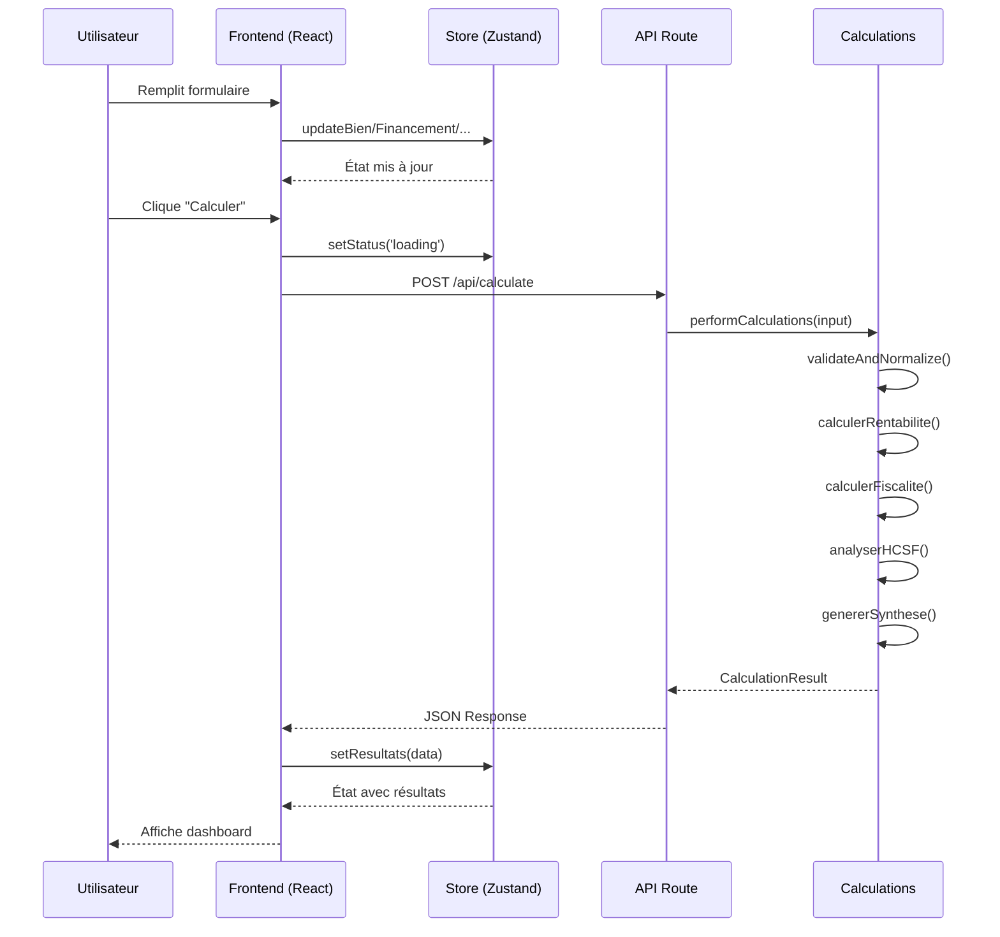

# Architecture Backend - Renta_Immo

> **Version** : 1.2
> **Date** : 2026-01-26
> **Auteur** : Winston (Architecte)
> **Statut** : Draft

---

## 1. Introduction

Ce document formalise l'architecture backend pour **Renta_Immo**, un simulateur de rentabilité immobilière. Il décrit l'ajout d'un backend de calcul natif Next.js en remplacement de la dépendance n8n existante.

### 1.1 Objectif

Migrer le moteur de calcul depuis n8n vers une solution intégrée à l'application Next.js existante, garantissant :
- Autonomie (pas de dépendance externe)
- Performance (< 500ms de temps de réponse)
- Maintenabilité (code TypeScript typé)
- Compatibilité (format de réponse API identique)

### 1.2 Documents de Référence

| Document | Chemin |
|----------|--------|
| PRD | [docs/prd.md](./prd.md) |
| Brief Architecte | [docs/brief-architecte.md](./brief-architecte.md) |
| Backlog MVP | [docs/backlog-mvp.md](./backlog-mvp.md) |

---

## 2. Analyse du Projet Existant

### 2.1 État Actuel (Frontend)

| Aspect | Technologie | Version |
|--------|-------------|---------|
| **Framework** | Next.js (App Router) | 14.2.21 |
| **Langage** | TypeScript (strict) | 5.7.3 |
| **React** | React | 18.3.1 |
| **State Management** | Zustand + persist | 5.0.10 |
| **Data Fetching** | TanStack React Query | 5.90.19 |
| **Validation** | Zod | 4.3.5 |
| **Forms** | React Hook Form | 7.71.1 |
| **Styling** | Tailwind CSS | 3.4.17 |

### 2.2 Patterns Existants Identifiés

| Pattern | Implémentation |
|---------|----------------|
| Barrel Exports | `index.ts` dans chaque dossier |
| Path Aliases | `@/*` → `./src/*` |
| State Persistence | Zustand middleware `persist` → localStorage |
| Validation | Schémas Zod partagés |
| Types | Interfaces TypeScript explicites |

### 2.3 Contraintes Identifiées

1. **Déploiement Vercel** : Environnement serverless, limites d'exécution
2. **Pas d'authentification MVP** : Simulations anonymes
3. **Compatibilité API** : Format de réponse identique à n8n
4. **Performance** : Calculs < 500ms

---

## 3. Décisions Architecturales (ADR)

### ADR-001 : Runtime Backend

| Option | Avantages | Inconvénients |
|--------|-----------|---------------|
| **Next.js API Routes** | Même codebase, déploiement Vercel natif, partage des types | Limites serverless |
| Serveur Express séparé | Plus de contrôle | Complexité déploiement |
| n8n (actuel) | Déjà fonctionnel | Dépendance externe, maintenance |

**Décision** : Next.js API Routes

**Justification** : Simplification de l'infrastructure, partage des types TypeScript, déploiement unifié sur Vercel.

---

### ADR-002 : Persistance des Données

| Option | Avantages | Inconvénients |
|--------|-----------|---------------|
| Pas de BDD | Simplicité, coût nul | Pas de partage entre appareils |
| Vercel Postgres | Intégré, serverless | Écosystème limité |
| **Supabase (PostgreSQL)** | Riche (Auth, Realtime, Storage), gratuit tier généreux | Dépendance externe |

**Décision** : Supabase (PostgreSQL) via MCP

**Justification** :
- **MCP (Model Context Protocol)** : Intégration native avec les outils de développement AI
- **PostgreSQL** : Base robuste, SQL standard, excellent support TypeScript
- **Supabase** : Tier gratuit généreux, Auth prêt pour V1, API REST auto-générée
- **Évolutivité** : Prépare le terrain pour les comptes utilisateurs (V1)

---

### ADR-003 : Génération PDF

| Option | Avantages | Inconvénients |
|--------|-----------|---------------|
| **@react-pdf/renderer** | Serverless-compatible, React natif | Styling limité |
| Puppeteer/Playwright | Rendu fidèle HTML/CSS | Taille bundle, timeout |
| jsPDF | Léger | API bas niveau |
| Gotenberg (Docker) | Qualité pro | Infrastructure externe |

**Décision** : @react-pdf/renderer (Phase 2)

**Justification** : Compatible serverless Vercel, génération < 3s, composants React réutilisables.

---

### ADR-004 : Structure du Code Backend

| Option | Avantages | Inconvénients |
|--------|-----------|---------------|
| **Modules séparés** | Testabilité, lisibilité | Plus de fichiers |
| Monolithique | Simplicité initiale | Difficile à maintenir |

**Décision** : Architecture modulaire dans `src/server/`

**Justification** : Séparation des préoccupations, facilite les tests unitaires, suit le principe de responsabilité unique.

---

## 4. Architecture Technique

### 4.1 Vue d'Ensemble

```
┌─────────────────────────────────────────────────────────────────┐
│                         CLIENT (Browser)                         │
│  ┌─────────────┐   ┌─────────────┐   ┌─────────────────────┐   │
│  │  Formulaire │ → │   Zustand   │ → │  React Query        │   │
│  │  (React     │   │   Store     │   │  (POST /api/calc)   │   │
│  │   Hook Form)│   │             │   │                     │   │
│  └─────────────┘   └─────────────┘   └──────────┬──────────┘   │
└────────────────────────────────────────────────┬────────────────┘
                                                 │ HTTPS
                                                 ▼
┌─────────────────────────────────────────────────────────────────┐
│                     SERVEUR (Next.js / Vercel)                  │
│  ┌─────────────────────────────────────────────────────────┐   │
│  │                   API Route Layer                        │   │
│  │  POST /api/calculate                                     │   │
│  └──────────────────────────┬──────────────────────────────┘   │
│                             │                                   │
│  ┌──────────────────────────▼──────────────────────────────┐   │
│  │              Moteur de Calcul (src/server/)              │   │
│  │  ┌───────────┐  ┌───────────┐  ┌───────────┐           │   │
│  │  │ validation│→ │rentabilite│→ │ fiscalite │           │   │
│  │  └───────────┘  └───────────┘  └───────────┘           │   │
│  │       │              │              │                   │   │
│  │       ▼              ▼              ▼                   │   │
│  │  ┌───────────┐  ┌───────────┐  ┌───────────┐           │   │
│  │  │   hcsf    │→ │  synthese │→ │  Response │           │   │
│  │  └───────────┘  └───────────┘  └───────────┘           │   │
│  └─────────────────────────────────────────────────────────┘   │
└─────────────────────────────────────────────────────────────────┘
```

### 4.2 Diagramme de Séquence



---

## 5. Stack Technique Backend

### 5.1 Technologies Retenues

| Catégorie | Technologie | Version | Justification |
|-----------|-------------|---------|---------------|
| **Runtime** | Node.js | 20.x LTS | Stable, support Vercel |
| **Framework** | Next.js API Routes | 14.2.21 | Intégré, serverless |
| **Langage** | TypeScript | 5.7.3 | Cohérence avec frontend |
| **Validation** | Zod | 4.3.5 | Schémas partagés |
| **PDF** (Phase 2) | @react-pdf/renderer | 3.x | Serverless-compatible |
| **Tests** | Vitest | 2.x | Rapide, compatible TS |

### 5.2 Technologies Futures (Post-MVP)

| Catégorie | Technologie | Phase | Justification |
|-----------|-------------|-------|---------------|
| **BDD** | Supabase (PostgreSQL) | 2 | MCP natif, Auth intégré, tier gratuit |
| **ORM** | Prisma ou Supabase Client | 2 | Type-safe, génération auto |
| **Auth** | Supabase Auth | V1 | Intégré, OAuth ready |
| **Email** | Resend | 3 | API moderne, Vercel-friendly |
| **Monitoring** | Vercel Analytics | 2 | Intégré |

---

## 6. Architecture des Composants Backend

### 6.1 Module de Calcul (`src/server/calculations/`)

```
src/server/calculations/
├── index.ts          # Orchestrateur principal
├── types.ts          # Types et constantes internes
├── validation.ts     # Validation Zod + normalisation
├── rentabilite.ts    # Calculs de rentabilité
├── fiscalite.ts      # Calculs fiscaux (IR/IS)
├── hcsf.ts           # Analyse HCSF
└── synthese.ts       # Scoring et recommandations
```

#### 6.1.1 `index.ts` - Orchestrateur

**Responsabilité** : Point d'entrée unique, coordination des calculs

**Interface** :
```typescript
function performCalculations(input: unknown): CalculationResult | CalculationError
```

**Flux** :
1. Validation et normalisation des entrées
2. Calculs de rentabilité (financement, charges, rendements)
3. Calculs fiscaux (selon régime)
4. Analyse HCSF (conformité bancaire)
5. Génération de la synthèse (scoring)
6. Assemblage du résultat final

---

#### 6.1.2 `validation.ts` - Validation

**Responsabilité** : Valider les entrées, appliquer les défauts, normaliser

**Fonctions** :
- `validateFormData(input)` : Validation Zod stricte
- `applyDefaults(data)` : Valeurs par défaut cohérentes
- `normalizeData(data)` : Normalisation des pourcentages

**Erreurs** : `ValidationError` avec code, champ, et détails

---

#### 6.1.3 `rentabilite.ts` - Calculs Financiers

**Responsabilité** : Tous les calculs de rentabilité

**Fonctions** :
- `calculerMensualite(capital, taux, duree, assurance)` : Formule PMT
- `calculerChargesAnnuelles(exploitation, loyer)` : Somme des charges
- `calculerRentabilite(bien, financement, exploitation)` : Orchestration

**Formules clés** :
```
Mensualité = [C × t × (1+t)^n] / [(1+t)^n - 1] + Assurance
Rentabilité Brute = (Loyer × 12) / Prix × 100
Rentabilité Nette = (Loyer × 12 - Charges) / Prix × 100
Cash-flow = Loyer - (Charges/12) - Mensualité
```

---

#### 6.1.4 `fiscalite.ts` - Calculs Fiscaux

**Responsabilité** : Imposition selon le régime choisi

**Régimes supportés** :

| Régime | Calcul |
|--------|--------|
| **Nom Propre (IR)** | Base × TMI + Base × 17.2% (PS) |
| **SCI à l'IS** | 15% jusqu'à 42 500€, 25% au-delà + amortissement 2% |

**Sortie** : `rentabilite_nette_nette` (après impôts)

---

#### 6.1.5 `hcsf.ts` - Conformité Bancaire

**Responsabilité** : Calcul du taux d'endettement HCSF

**Règles HCSF 2024** :
- Taux d'endettement max : 35%
- Revenus locatifs pondérés à 70%
- Durée crédit max : 25 ans

**Modes** :
- **Nom propre** : Calcul sur l'investisseur principal
- **SCI IS** : Calcul par associé (quote-part)

---

#### 6.1.6 `synthese.ts` - Scoring

**Responsabilité** : Score global et recommandations

**Critères** (4 points max) :
1. Autofinancement (cash-flow ≥ 0)
2. Rentabilité nette ≥ 7%
3. Conformité HCSF
4. Bonus : Rentabilité ≥ 10%

**Score Global** : 0-100 points avec pondération

**Évaluations** : Excellent / Bon / Moyen / Faible

---

### 6.2 API Route (`src/app/api/calculate/`)

```typescript
// src/app/api/calculate/route.ts
export const runtime = 'nodejs';
export const maxDuration = 30;

export async function POST(request: NextRequest): Promise<NextResponse>
export async function OPTIONS(): Promise<NextResponse>  // CORS
```

**Endpoint** : `POST /api/calculate`

**Request** :
```typescript
{
  bien: BienData;
  financement: FinancementData;
  exploitation: ExploitationData;
  structure: StructureData;
  options: OptionsData;
}
```

**Response (Succès)** :
```typescript
{
  success: true;
  resultats: CalculResultats;
  pdf_url: string | null;
  timestamp: string;
  alertes: string[];
}
```

**Response (Erreur)** :
```typescript
{
  success: false;
  error: string;
  code: 'VALIDATION_ERROR' | 'CALCULATION_ERROR' | 'SERVER_ERROR';
  field?: string;
  details?: Record<string, unknown>;
}
```

---

## 7. Structure des Fichiers

### 7.1 Arbre Source Actuel

```
src/
├── app/
│   ├── api/
│   │   └── calculate/
│   │       └── route.ts          # API endpoint
│   ├── page.tsx                  # Page principale
│   └── layout.tsx
│
├── server/                        # NOUVEAU : Backend
│   └── calculations/
│       ├── index.ts              # Orchestrateur
│       ├── types.ts              # Types internes
│       ├── validation.ts         # Validation Zod
│       ├── rentabilite.ts        # Calculs financiers
│       ├── fiscalite.ts          # Calculs fiscaux
│       ├── hcsf.ts               # Analyse HCSF
│       └── synthese.ts           # Scoring
│
├── components/
│   ├── forms/                    # Composants formulaire
│   ├── results/                  # Composants résultats
│   ├── providers/                # Providers React
│   └── ui/                       # Composants UI
│
├── hooks/
│   ├── useCalculateur.ts         # Hook principal
│   └── index.ts
│
├── stores/
│   └── calculateur.store.ts      # Store Zustand
│
├── lib/
│   ├── api.ts                    # Client API (modifié)
│   ├── validators.ts             # Schémas Zod
│   ├── constants.ts
│   └── utils.ts
│
└── types/
    ├── calculateur.ts            # Types métier
    ├── api.ts                    # Types API
    └── index.ts
```

### 7.2 Extensions Futures

```
src/
├── server/
│   ├── calculations/             # Existant
│   ├── pdf/                      # Phase 2
│   │   ├── templates/
│   │   │   └── rapport.tsx       # Template React PDF
│   │   └── generator.ts          # Générateur
│   ├── db/                       # Phase 2 (Supabase)
│   │   ├── client.ts             # Client Supabase
│   │   ├── types.ts              # Types générés
│   │   └── queries/
│   │       └── simulations.ts    # Requêtes typées
│   └── email/                    # Phase 3
│       ├── templates/
│       └── sender.ts
│
├── lib/
│   └── supabase/                 # Phase 2
│       ├── client.ts             # Client browser
│       └── server.ts             # Client server (SSR)
│
├── app/
│   └── api/
│       ├── calculate/            # Existant
│       ├── pdf/                  # Phase 2
│       │   └── route.ts
│       └── simulations/          # Phase 2 (Supabase)
│           ├── route.ts          # GET (list), POST (create)
│           └── [id]/
│               └── route.ts      # GET, DELETE
```

---

## 8. Intégration Frontend

### 8.1 Modification de `src/lib/api.ts`

**Avant** :
```typescript
const N8N_WEBHOOK_URL = process.env.NEXT_PUBLIC_N8N_WEBHOOK_URL;
```

**Après** :
```typescript
const API_URL = '/api/calculate';
```

**Impact** : 1 ligne modifiée, zéro changement de comportement côté utilisateur.

### 8.2 Compatibilité du Format de Réponse

Le format de réponse de l'API `/api/calculate` est **strictement identique** à celui de l'ancien webhook n8n :

```typescript
// Structure de réponse identique
{
  success: boolean;
  resultats: CalculResultats;
  pdf_url: string | null;
  timestamp: string;
  alertes?: string[];
}
```

Cela garantit que :
- Le store Zustand n'a pas besoin de modification
- Les composants de résultats fonctionnent sans changement
- La migration est transparente pour l'utilisateur

---

## 9. Déploiement et Infrastructure

### 9.1 Environnement Vercel

| Paramètre | Valeur |
|-----------|--------|
| **Runtime** | Node.js 20.x |
| **Region** | Auto (Edge optimized) |
| **Max Duration** | 30s (API Routes) |
| **Memory** | 1024 MB |

### 9.2 Variables d'Environnement

| Variable | Description | Requis MVP | Phase |
|----------|-------------|------------|-------|
| `NEXT_PUBLIC_N8N_WEBHOOK_URL` | (Déprécié) URL n8n | Non | - |
| `NEXT_PUBLIC_SUPABASE_URL` | URL du projet Supabase | Non | 2 |
| `NEXT_PUBLIC_SUPABASE_ANON_KEY` | Clé publique Supabase | Non | 2 |
| `SUPABASE_SERVICE_ROLE_KEY` | Clé serveur Supabase (server-only) | Non | 2 |

### 9.3 Pipeline CI/CD

```
Push GitHub → Vercel Build → Preview/Production
     │              │
     │              └── next build
     │                      │
     │                      ├── Lint (ESLint)
     │                      └── Type Check (tsc)
     │
     └── Tests (optionnel, Phase 2)
```

---

## 9.5 Architecture Supabase (Phase 2)

### Intégration MCP

L'accès à Supabase se fera via **MCP (Model Context Protocol)**, permettant une interaction directe avec la base de données depuis les outils de développement AI.

```
┌─────────────────┐     ┌─────────────────┐     ┌─────────────────┐
│   Claude Code   │ ──► │   MCP Server    │ ──► │    Supabase     │
│   (Dev Tools)   │     │   (Supabase)    │     │   PostgreSQL    │
└─────────────────┘     └─────────────────┘     └─────────────────┘
```

### Schéma de Base de Données (Prévu)

```sql
-- Table des simulations
CREATE TABLE simulations (
  id UUID PRIMARY KEY DEFAULT gen_random_uuid(),
  created_at TIMESTAMPTZ DEFAULT NOW(),
  updated_at TIMESTAMPTZ DEFAULT NOW(),

  -- Données d'entrée (JSON)
  input_data JSONB NOT NULL,

  -- Résultats calculés (JSON)
  results JSONB NOT NULL,

  -- Métadonnées
  name VARCHAR(255),
  user_id UUID REFERENCES auth.users(id),  -- V1 avec auth

  -- Index pour recherche
  CONSTRAINT valid_input CHECK (input_data ? 'bien' AND input_data ? 'financement')
);

-- Index pour performance
CREATE INDEX idx_simulations_user ON simulations(user_id);
CREATE INDEX idx_simulations_created ON simulations(created_at DESC);
```

### API Supabase (Phase 2)

| Endpoint | Méthode | Description |
|----------|---------|-------------|
| `/api/simulations` | POST | Créer une simulation |
| `/api/simulations` | GET | Lister les simulations |
| `/api/simulations/[id]` | GET | Récupérer une simulation |
| `/api/simulations/[id]` | DELETE | Supprimer une simulation |

### Avantages MCP + Supabase

1. **Développement accéléré** : Manipulation directe des données via Claude
2. **Type-safety** : Génération automatique des types TypeScript
3. **Scalabilité** : PostgreSQL robuste + CDN Supabase
4. **Auth ready** : Supabase Auth pour V1 (comptes utilisateurs)

---

## 10. Standards de Code

### 10.1 Conventions

| Élément | Convention | Exemple |
|---------|------------|---------|
| **Fichiers** | kebab-case | `rentabilite.ts` |
| **Fonctions** | camelCase | `calculerRentabilite()` |
| **Types/Interfaces** | PascalCase | `CalculationResult` |
| **Constantes** | SCREAMING_SNAKE | `SEUILS.TAUX_ENDETTEMENT_MAX` |

### 10.2 Règles Critiques

1. **Pas de `any`** : TypeScript strict mode activé
2. **Validation Zod** : Toute entrée externe doit être validée
3. **Pas de secrets en dur** : Utiliser les variables d'environnement
4. **Barrel exports** : Chaque dossier avec `index.ts`
5. **Fonctions pures** : Calculs sans effets de bord

### 10.3 Documentation

- JSDoc pour les fonctions publiques
- Commentaires français (cohérence projet)
- README par module si complexe

---

## 11. Stratégie de Tests

### 11.1 Tests Unitaires (Phase 2)

| Module | Priorité | Couverture cible |
|--------|----------|------------------|
| `validation.ts` | Haute | 90% |
| `rentabilite.ts` | Haute | 95% |
| `fiscalite.ts` | Haute | 95% |
| `hcsf.ts` | Haute | 90% |
| `synthese.ts` | Moyenne | 80% |

### 11.2 Framework de Test

```typescript
// vitest.config.ts
import { defineConfig } from 'vitest/config';

export default defineConfig({
  test: {
    environment: 'node',
    globals: true,
    include: ['src/**/*.test.ts'],
  },
});
```

### 11.3 Tests de Non-Régression

Comparer les résultats du nouveau backend avec les résultats n8n :
- Dataset de référence (10-20 cas types)
- Tolérance : écart < 0.01%
- Exécution avant chaque release

---

## 12. Sécurité

### 12.1 Validation des Entrées

- **Toutes les entrées** passent par Zod
- **Types numériques** bornés (min/max)
- **Strings** sanitisées (longueur max)

### 12.2 Gestion des Erreurs

- Pas d'exposition des stack traces en production
- Codes d'erreur explicites sans détails sensibles
- Logging côté serveur uniquement

### 12.3 CORS

- API Route avec headers CORS appropriés
- Preflight OPTIONS supporté

---

## 13. Plan d'Implémentation

### Phase 1 : Migration Calculs (Actuel)

- [x] Structure `src/server/calculations/`
- [x] Module `validation.ts`
- [x] Module `rentabilite.ts`
- [x] Module `fiscalite.ts`
- [x] Module `hcsf.ts`
- [x] Module `synthese.ts`
- [x] API Route `/api/calculate`
- [x] Modification `src/lib/api.ts`
- [ ] Vérification TypeScript
- [ ] Tests manuels E2E

### Phase 2 : PDF + Persistance Supabase

- [ ] Installation @react-pdf/renderer
- [ ] Template PDF React
- [ ] API Route `/api/pdf`
- [ ] Configuration Supabase (projet + clés)
- [ ] Setup client Supabase (`src/lib/supabase/`)
- [ ] Schéma PostgreSQL (table `simulations`)
- [ ] API Routes `/api/simulations`
- [ ] Intégration MCP Supabase

### Phase 3 : Email (Optionnel)

- [ ] Setup Resend
- [ ] Templates email
- [ ] Intégration API

---

## 14. Métriques de Succès

| Métrique | Cible | Mesure |
|----------|-------|--------|
| Temps de réponse API | < 500ms | Vercel Analytics |
| Erreurs API | < 0.1% | Logs |
| Précision calculs | Identique n8n | Tests régression |
| Couverture tests | > 80% | Vitest |

---

## 15. Changelog

| Date | Version | Description | Auteur |
|------|---------|-------------|--------|
| 2026-01-25 | 1.0 | Création initiale | Winston |
| 2026-01-25 | 1.1 | Ajout Supabase (PostgreSQL) via MCP | Winston |
| 2026-01-26 | 1.2 | Ajout Section 17 : Guide PM - Mapping Sprints & Stories | Winston |

---

## 16. Prochaines Étapes

### Pour le Développeur

1. Vérifier la compilation TypeScript (`npm run type-check`)
2. Tester l'API manuellement avec un payload de test
3. Valider la compatibilité du format de réponse avec le frontend
4. Documenter les cas de test de non-régression

### Pour le PM

1. Valider l'architecture proposée
2. Prioriser Phase 2 (PDF) vs Phase 3 (Email)
3. Définir les critères d'acceptation pour les tests

---

## 17. Guide PM - Mapping Sprints & Stories

> Cette section permet au PM de créer les sprints et stories en mappant l'architecture technique aux items du backlog.

### 17.1 Mapping Architecture → Backlog

| Module Architecture | Item Backlog | Priorité | Complexité |
|---------------------|--------------|----------|------------|
| `src/server/calculations/index.ts` | **MVP-024** Moteur de calcul autonome | P1 | L |
| `src/server/calculations/validation.ts` | MVP-024 (partie) | P1 | S |
| `src/server/calculations/rentabilite.ts` | MVP-024 (partie) | P1 | M |
| `src/server/calculations/fiscalite.ts` | MVP-024 (partie) | P1 | M |
| `src/server/calculations/hcsf.ts` | MVP-024 (partie) | P1 | S |
| `src/server/calculations/synthese.ts` | MVP-024 (partie) | P1 | S |
| `src/app/api/calculate/route.ts` | **MVP-025** API de simulation | P1 | M |
| `src/lib/api.ts` (modification) | MVP-025 (partie) | P1 | XS |
| `src/server/pdf/` | **MVP-027** Génération PDF | P2 | M |
| `src/server/db/` | **MVP-026** Sauvegarde simulations | P2 | M |
| `src/app/api/simulations/` | MVP-026 (partie) | P2 | S |

---

### 17.2 Découpage en Stories Techniques

#### Epic 1 : Moteur de Calcul (MVP-024)

| Story ID | Titre | Description | Complexité | Dépendances |
|----------|-------|-------------|------------|-------------|
| TECH-001 | **Structure calculs** | Créer `src/server/calculations/` avec orchestrateur | S | - |
| TECH-002 | **Validation entrées** | Implémenter `validation.ts` avec schémas Zod | S | TECH-001 |
| TECH-003 | **Calculs rentabilité** | Implémenter `rentabilite.ts` (brute, nette, cashflow) | M | TECH-002 |
| TECH-004 | **Calculs fiscalité** | Implémenter `fiscalite.ts` (IR, IS, régimes) | M | TECH-002 |
| TECH-005 | **Analyse HCSF** | Implémenter `hcsf.ts` (taux endettement) | S | TECH-002 |
| TECH-006 | **Synthèse scoring** | Implémenter `synthese.ts` (score, recommandations) | S | TECH-003, TECH-004, TECH-005 |
| TECH-007 | **Tests régression** | Comparer résultats avec n8n (dataset référence) | M | TECH-006 |

#### Epic 2 : API de Simulation (MVP-025)

| Story ID | Titre | Description | Complexité | Dépendances |
|----------|-------|-------------|------------|-------------|
| TECH-008 | **Route POST /api/calculate** | Créer endpoint avec CORS et gestion erreurs | S | MVP-024 |
| TECH-009 | **Intégration frontend** | Modifier `src/lib/api.ts` vers API interne | XS | TECH-008 |
| TECH-010 | **Documentation API** | OpenAPI / Swagger pour l'endpoint | XS | TECH-008 |

#### Epic 3 : Génération PDF (MVP-027)

| Story ID | Titre | Description | Complexité | Dépendances |
|----------|-------|-------------|------------|-------------|
| TECH-011 | **Setup react-pdf** | Installer et configurer @react-pdf/renderer | XS | - |
| TECH-012 | **Template rapport** | Créer `src/server/pdf/templates/rapport.tsx` | M | TECH-011 |
| TECH-013 | **Route /api/pdf** | Endpoint génération PDF | S | TECH-012, MVP-024 |
| TECH-014 | **Intégration UI** | Bouton téléchargement dans ResultsPanel | S | TECH-013 |

#### Epic 4 : Persistance Supabase (MVP-026)

| Story ID | Titre | Description | Complexité | Dépendances |
|----------|-------|-------------|------------|-------------|
| TECH-015 | **Setup Supabase** | Créer projet, configurer clés, variables env | S | - |
| TECH-016 | **Schéma BDD** | Créer table `simulations` avec migrations | S | TECH-015 |
| TECH-017 | **Client Supabase** | `src/lib/supabase/client.ts` et `server.ts` | S | TECH-015 |
| TECH-018 | **API CRUD simulations** | Routes `/api/simulations` (POST, GET, DELETE) | M | TECH-016, TECH-017 |
| TECH-019 | **Intégration UI** | Liste simulations, bouton sauvegarde | M | TECH-018 |

---

### 17.3 Graphe de Dépendances

```
                    ┌─────────────┐
                    │  TECH-001   │ Structure
                    └──────┬──────┘
                           │
                    ┌──────▼──────┐
                    │  TECH-002   │ Validation
                    └──────┬──────┘
           ┌───────────────┼───────────────┐
           ▼               ▼               ▼
     ┌───────────┐   ┌───────────┐   ┌───────────┐
     │ TECH-003  │   │ TECH-004  │   │ TECH-005  │
     │Rentabilité│   │ Fiscalité │   │   HCSF    │
     └─────┬─────┘   └─────┬─────┘   └─────┬─────┘
           └───────────────┼───────────────┘
                    ┌──────▼──────┐
                    │  TECH-006   │ Synthèse
                    └──────┬──────┘
                           │
              ┌────────────┼────────────┐
              ▼            ▼            ▼
        ┌───────────┐┌───────────┐┌───────────┐
        │ TECH-007  ││ TECH-008  ││ TECH-013  │
        │  Tests    ││   API     ││   PDF     │
        └───────────┘└─────┬─────┘└───────────┘
                           │
                    ┌──────▼──────┐
                    │  TECH-009   │ Frontend
                    └─────────────┘
```

---

### 17.4 Sprint Planning Recommandé

#### Sprint 0.1 — Fondations Backend (1 semaine)

| Story | Points | Responsabilité |
|-------|--------|----------------|
| TECH-001 | 2 | Backend Dev |
| TECH-002 | 3 | Backend Dev |
| **Total** | **5** | |

**Objectif** : Structure et validation en place

**Critères d'acceptation Sprint** :
- [ ] `npm run type-check` passe
- [ ] `performCalculations()` appelable (retourne erreur validation)

---

#### Sprint 0.2 — Calculs Core (1.5 semaines)

| Story | Points | Responsabilité |
|-------|--------|----------------|
| TECH-003 | 5 | Backend Dev |
| TECH-004 | 5 | Backend Dev |
| TECH-005 | 3 | Backend Dev |
| **Total** | **13** | |

**Objectif** : Tous les calculs implémentés

**Critères d'acceptation Sprint** :
- [ ] Rentabilité brute/nette/nette-nette calculées
- [ ] Cashflow mensuel/annuel corrects
- [ ] Fiscalité IR et IS fonctionnelles
- [ ] Taux HCSF correct selon mode

---

#### Sprint 0.3 — Intégration (1 semaine)

| Story | Points | Responsabilité |
|-------|--------|----------------|
| TECH-006 | 3 | Backend Dev |
| TECH-007 | 5 | QA + Backend |
| TECH-008 | 3 | Backend Dev |
| TECH-009 | 1 | Frontend Dev |
| **Total** | **12** | |

**Objectif** : API fonctionnelle, frontend connecté

**Critères d'acceptation Sprint** :
- [ ] POST `/api/calculate` retourne résultats corrects
- [ ] Frontend utilise API interne (n8n décommissionné)
- [ ] Tests régression : écart < 0.01% vs n8n
- [ ] Performance < 500ms

---

#### Sprint 1 — PDF (Phase 2, 1.5 semaines)

| Story | Points | Responsabilité |
|-------|--------|----------------|
| TECH-011 | 1 | Backend Dev |
| TECH-012 | 5 | Backend Dev |
| TECH-013 | 3 | Backend Dev |
| TECH-014 | 3 | Frontend Dev |
| **Total** | **12** | |

**Critères d'acceptation Sprint** :
- [ ] PDF généré en < 3s
- [ ] Toutes les données présentes
- [ ] Téléchargement fonctionnel

---

#### Sprint 2 — Supabase (Phase 2, 1.5 semaines)

| Story | Points | Responsabilité |
|-------|--------|----------------|
| TECH-015 | 2 | DevOps |
| TECH-016 | 3 | Backend Dev |
| TECH-017 | 3 | Backend Dev |
| TECH-018 | 5 | Backend Dev |
| TECH-019 | 5 | Frontend Dev |
| **Total** | **18** | |

**Critères d'acceptation Sprint** :
- [ ] CRUD simulations fonctionnel
- [ ] Récupération par ID avec lien partageable
- [ ] Liste des simulations récentes

---

### 17.5 Critères d'Acceptation Techniques (DoD)

Chaque story technique doit respecter :

| Critère | Obligatoire |
|---------|-------------|
| **TypeScript** : Pas d'erreur `tsc --noEmit` | ✅ |
| **Lint** : Pas d'erreur ESLint | ✅ |
| **Types** : Pas de `any` explicite | ✅ |
| **Validation** : Entrées validées par Zod | ✅ |
| **Tests unitaires** : Couverture > 80% (modules calculs) | Phase 2 |
| **Documentation** : JSDoc fonctions publiques | ✅ |
| **Code review** : PR approuvée | ✅ |

---

### 17.6 Vélocité Estimée

| Métrique | Valeur |
|----------|--------|
| **Points/Sprint** (1 dev) | 10-12 |
| **Sprint 0 total** | ~30 points |
| **Durée estimée Sprint 0** | 3-4 semaines |
| **Sprint 1 (PDF)** | ~12 points (1.5 sem) |
| **Sprint 2 (Supabase)** | ~18 points (2 sem) |

---

### 17.7 Risques et Mitigations

| Risque | Impact | Probabilité | Mitigation |
|--------|--------|-------------|------------|
| Écarts calculs vs n8n | Haut | Moyenne | Dataset référence + tests régression |
| Performance PDF | Moyen | Faible | Timeout 30s, optimisation lazy |
| Complexité fiscale | Moyen | Moyenne | Validation expert-comptable |
| Setup Supabase | Bas | Faible | Documentation officielle claire |

---

### 17.8 Définition de "Done" par Epic

#### MVP-024 (Moteur de calcul)
- [ ] Tous les calculs implémentés (rentabilité, fiscalité, HCSF, synthèse)
- [ ] Résultats identiques à n8n (tolérance 0.01%)
- [ ] Performance < 500ms
- [ ] Couverture tests > 80%

#### MVP-025 (API simulation)
- [ ] Endpoint POST `/api/calculate` fonctionnel
- [ ] Gestion erreurs avec codes explicites
- [ ] CORS configuré
- [ ] Frontend connecté

#### MVP-026 (Sauvegarde)
- [ ] Table `simulations` créée
- [ ] CRUD fonctionnel via API
- [ ] Lien partageable par ID

#### MVP-027 (PDF)
- [ ] Template React PDF complet
- [ ] Génération < 3s
- [ ] Téléchargement depuis UI
