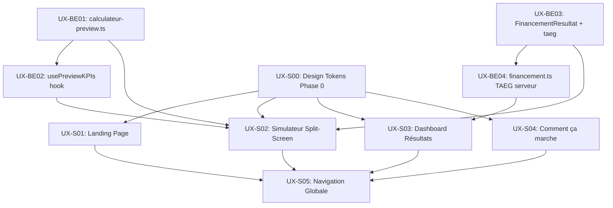

# Stories — Migration UX « Verdant Simulator »

> **Epic** : Migration UX Nordic Minimalist (Verdant Simulator / Petra Nova)
> **Plan UX** : `docs/ux/stitch/v1/plan-migration-ux.md` (Sally, UX Designer)
> **Plan Technique** : `docs/ux/stitch/v1/plan-technique-migration-ux.md` (Winston, Architecte)
> **Date de création** : 2026-03-25
> **Product Manager** : John (PM Agent)

---

## Matrice des Dépendances



---

## Sprint Planning

### Sprint 1 — Fondations (Phase 0 + Backend)

| Story                                                    | Titre                                          | Effort | Priorité | Branche                               |
| -------------------------------------------------------- | ---------------------------------------------- | ------ | -------- | ------------------------------------- |
| ✅ [UX-S00](story-ux-s00-design-tokens.md)               | Design Tokens « Verdant Simulator »            | M      | P0       | `feature/verdant-design-tokens`       |
| ✅ [UX-BE01](story-ux-be01-calculateur-preview.md)       | Moteur calcul partiel `calculateur-preview.ts` | M      | P0 🔴    | `feature/verdant-calculateur-preview` |
| ✅ [UX-BE02](story-ux-be02-use-preview-kpis.md)          | Hook Zustand `usePreviewKPIs`                  | S      | P0 🔴    | `feature/verdant-calculateur-preview` |
| ✅ [UX-BE03](story-ux-be03-taeg-financement-resultat.md) | Exposer TAEG dans `FinancementResultat`        | M      | P1 🟠    | `feature/verdant-taeg-financement`    |
| ✅ [UX-BE04](story-ux-be04-calcul-taeg-serveur.md)       | Calcul TAEG exact côté serveur                 | M      | P1 🟠    | `feature/verdant-taeg-financement`    |

**Estimation Sprint 1** : ~8 points

---

### Sprint 2 — Landing Page & Layout Simulateur (Phase 1 + Phase 2 layout) ✅ MERGÉ

| Story                                                 | Titre                                            | Effort | Priorité | Branche                        |
| ----------------------------------------------------- | ------------------------------------------------ | ------ | -------- | ------------------------------ |
| ✅ [UX-S01](story-ux-s01-landing-page.md)             | Landing Page « Petra Nova »                      | M      | P1       | `feature/verdant-landing-page` |
| ✅ [UX-S02a](story-ux-s02-simulateur-split-screen.md) | Simulateur — `SimulatorLayout` + `ResultsAnchor` | L      | P1       | `feature/verdant-simulator`    |

**Estimation Sprint 2** : ~10 points | **Résultat** : 596 TU verts — PR #64 (UX-S01) + PR #65 (UX-S02a) mergées

---

### Sprint 3 — Steps Formulaire & Dashboard (Phase 2 steps + Phase 3) ✅ DONE

| Story                                                | Titre                                       | Effort | Priorité | Branche                     |
| ---------------------------------------------------- | ------------------------------------------- | ------ | -------- | --------------------------- |
| ✅ [UX-S02](story-ux-s02-simulateur-split-screen.md) | Simulateur — Steps 1–5 & Stepper horizontal | L      | P1       | `feature/verdant-simulator` |
| ✅ [UX-S03](story-ux-s03-dashboard-resultats.md)     | Dashboard Résultats & Projections à 20 ans  | L      | P1       | `feature/verdant-simulator` |

**Estimation Sprint 3** : ~10 points | **Résultat** : 640 TU verts (596 → +44)

**Scope UX-S02 livré (sections 3.3–3.6)** :

- ✅ 3.3 `ProgressStepper` redesigné en horizontal (cercles numérotés ① ——— ② ——— …) + labels
- ✅ 3.4 Préservation stricte des champs formulaire (accordéons `<Collapsible>` « Options avancées »)
- ✅ 3.5 `StepStructure` : 3 cartes expansibles LMNP/RF/SCI IS → double data model préservé
- ✅ 3.6 `VerdantSlider` (Steps 2 & 3 — taux d'occupation + pondération HCSF)

**Scope UX-S03 livré** :

- ✅ `Dashboard.tsx` — refonte 4 onglets (Analyse, Projections, + 2 stubs), suppression scroll-spy/IntersectionObserver et SideNavigation
- ✅ `MetricCard.tsx` — tonal card sans bordures, hover lift, tokens Verdant
- ✅ `FiscalComparator.tsx` — liste verticale de cartes avec badges RECOMMANDÉ/VOTRE CHOIX
- ✅ `AmortizationTable.tsx` — accordéon inline (5 lignes preview) en remplacement du modal
- ✅ `CashflowChart.tsx` + `PatrimoineChart.tsx` — couleurs migrées sur `VerdantChartPalette`
- ✅ `DownloadPdfButton.tsx` — pill style + tokens Verdant + Lucide icons

---

### Sprint 4 — Contenu & Navigation (Phase 4 + Phase 5)

| Story                                           | Titre                                              | Effort | Priorité | Branche                        |
| ----------------------------------------------- | -------------------------------------------------- | ------ | -------- | ------------------------------ |
| ✅ [UX-S04](story-ux-s04-comment-ca-marche.md)  | « Comment ça marche » — Restructuration sous-pages | L      | P1       | `feature/verdant-how-it-works` |
| ✅ [UX-S05](story-ux-s05-navigation-globale.md) | Navigation Globale — Intégration Navbar & Footer   | S      | P2       | `feature/verdant-navigation`   |

**Estimation Sprint 4** : ~8 points | **Résultat** : 711 TU verts — UX-S04 + UX-S05 DONE

---

## ⚠️ Risques Identifiés par l'Architecte (Winston)

| Risque                                              | Criticité            | Mitigation                                                                 |
| --------------------------------------------------- | -------------------- | -------------------------------------------------------------------------- |
| Calcul partiel temps réel (sidebar)                 | 🔴 Bloquant Phase 2  | BE-01 + BE-02 doivent être en Sprint 1                                     |
| TAEG non exposé dans l'API                          | 🟠 Requis Phase 2    | BE-03 + BE-04 en Sprint 1                                                  |
| Tailwind v4 CSS-first — pas de `tailwind.config.ts` | 🟠 Requis Phase 0    | Transposer les tokens v3 des `code.html` en `@theme {}` dans `globals.css` |
| Routing `/comment-ca-marche` vs `/en-savoir-plus`   | 🟡 Important Phase 4 | Redirection 301 dans `next.config.ts` + conserver fichier `en-savoir-plus` |

## 🚨 Règles d'Or de la Migration

1. **Zéro régression de calculs** : Lancer `npm run test:regression` après chaque phase
2. **0 champ de formulaire supprimé** : Champs non visibles → accordéon « Options avancées »
3. **6 régimes fiscaux préservés** : LMNP Micro-BIC/Réel, Micro-Foncier/Réel, SCI IS Capitalisation/Distribution
4. **100% du contenu pédagogique migré** : Grep des formules clés obligatoire en DoD Phase 4
5. **TypeScript strict** : Aucun `any` autorisé — types inférés ou déclarés via `src/types/`

## Checklist Pré-PR (à copier dans chaque PR)

```
- [ ] `npm run type-check` — 0 erreur
- [ ] `npm run lint` — 0 warning
- [ ] `npm run test` — 530+ TU verts
- [ ] `npm run test:regression` — régression calcul = 0
- [ ] Vérification visuelle 3 viewports (375px, 768px, 1440px)
- [ ] Aucun `any` TypeScript introduit
- [ ] TU ajoutés pour tout nouveau code
```
