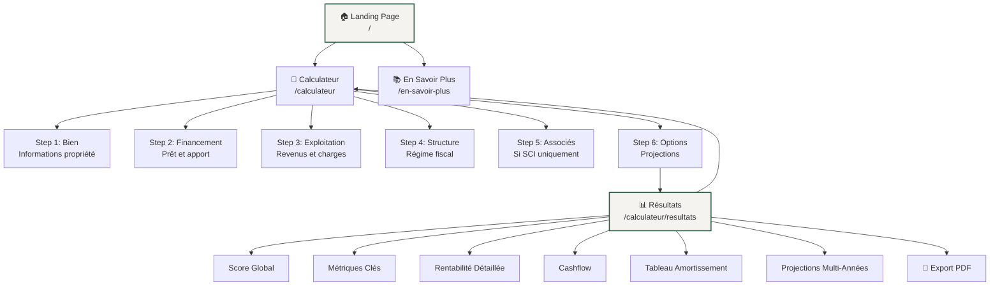
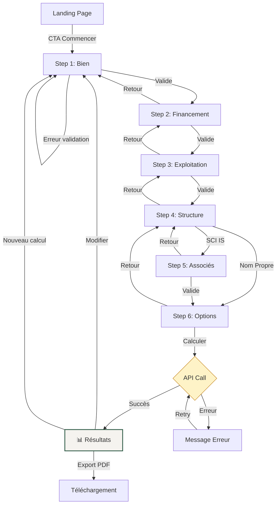
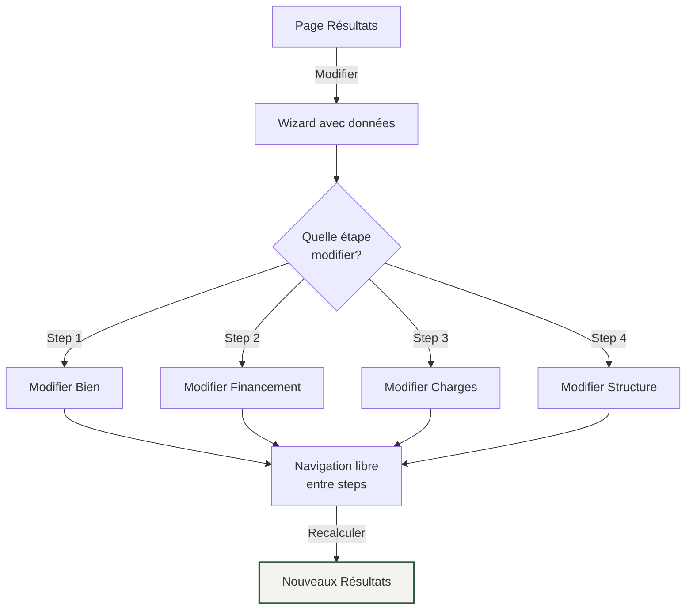
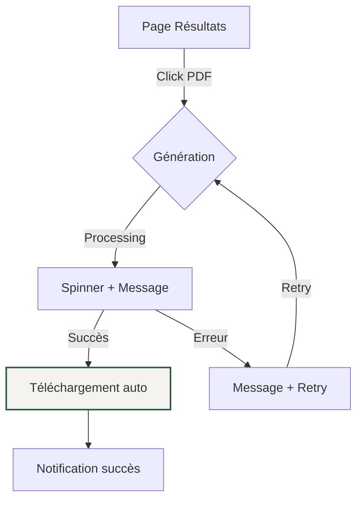
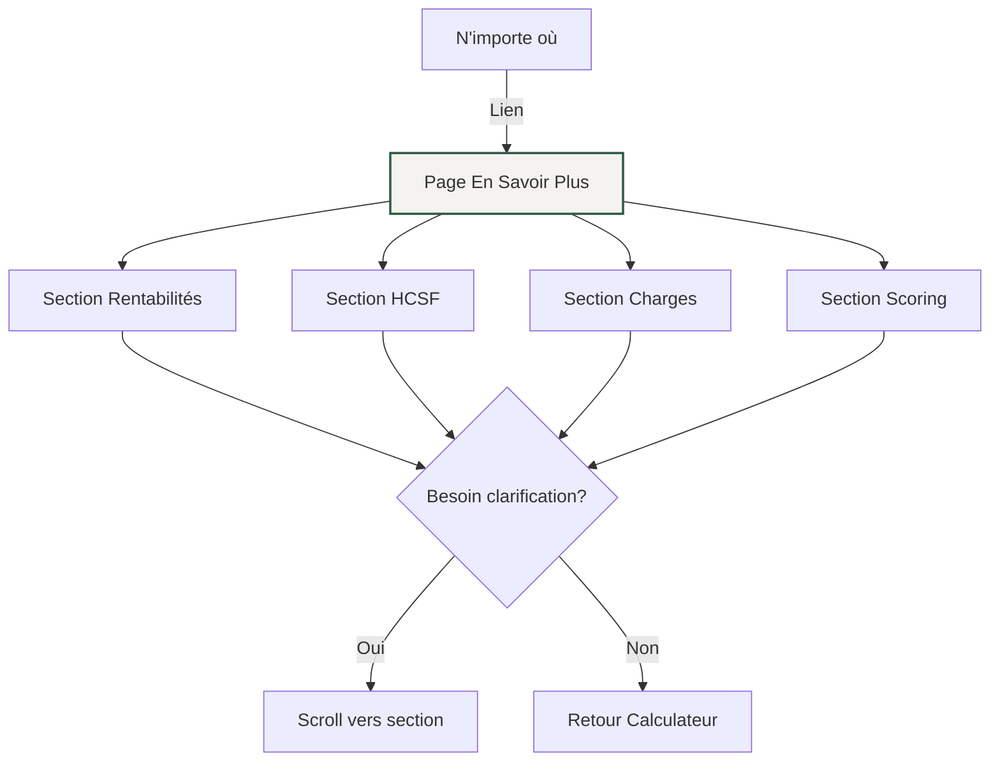

# Renta_Immo UI/UX Specification

> **Version:** 1.0
> **Date:** 2026-01-28
> **Direction Design:** Nordic Minimal
> **Auteur:** Sally (UX Expert)

---

Ce document définit les objectifs d'expérience utilisateur, l'architecture de l'information, les flux utilisateurs et les spécifications de design visuel pour l'interface de **Renta_Immo**. Il sert de fondation pour le design visuel et le développement frontend, assurant une expérience cohérente et centrée sur l'utilisateur.

---

## Table des Matières

1. [Overall UX Goals & Principles](#1-overall-ux-goals--principles)
2. [Information Architecture](#2-information-architecture)
3. [User Flows](#3-user-flows)
4. [Wireframes & Mockups](#4-wireframes--mockups)
5. [Component Library](#5-component-library)
6. [Branding & Style Guide](#6-branding--style-guide)
7. [Accessibility Requirements](#7-accessibility-requirements)
8. [Responsiveness Strategy](#8-responsiveness-strategy)
9. [Animation & Micro-interactions](#9-animation--micro-interactions)
10. [Performance Considerations](#10-performance-considerations)
11. [Next Steps](#11-next-steps)

---

## 1. Overall UX Goals & Principles

### Target User Personas

**Persona 1 : L'Investisseur Débutant** 🌱
- **Profil :** 30-45 ans, premier investissement locatif envisagé
- **Contexte :** A économisé un apport, cherche à comprendre si un bien est rentable
- **Besoins :** Guidance claire, termes expliqués, résultats compréhensibles
- **Frustrations :** Jargon financier complexe, calculs manuels fastidieux, incertitude sur les charges à prévoir
- **Objectif :** Prendre une décision éclairée sans être expert

**Persona 2 : L'Investisseur Expérimenté** 📊
- **Profil :** 40-60 ans, possède déjà 1-5 biens locatifs
- **Contexte :** Compare plusieurs opportunités rapidement
- **Besoins :** Efficacité, données détaillées, projections multi-années, export PDF
- **Frustrations :** Outils trop simplistes, manque de détails fiscaux, pas de comparaison possible
- **Objectif :** Analyser rapidement pour arbitrer entre plusieurs biens

**Persona 3 : Le Conseiller Immobilier** 🏠
- **Profil :** Agent immobilier ou CGP (Conseiller en Gestion de Patrimoine)
- **Contexte :** Accompagne des clients dans leurs décisions d'investissement
- **Besoins :** Outil professionnel, PDF présentable, résultats crédibles
- **Frustrations :** Outils gratuits peu fiables, présentation amateur
- **Objectif :** Démontrer la valeur d'un bien à ses clients

---

### Usability Goals

| Objectif | Métrique | Cible |
|----------|----------|-------|
| **Facilité d'apprentissage** | Temps pour compléter un premier calcul | < 3 minutes |
| **Efficacité d'utilisation** | Nombre de clics pour un calcul complet | < 25 clics |
| **Prévention d'erreurs** | Taux d'abandon du formulaire | < 20% |
| **Mémorabilité** | Utilisateurs revenant sans aide | > 80% |
| **Satisfaction** | Score de recommandation (NPS) | > 50 |

---

### Design Principles

1. **Clarté avant tout** — Chaque élément doit avoir un but évident. Pas de décoration superflue.

2. **Progression naturelle** — Guider l'utilisateur étape par étape, du simple au complexe.

3. **Feedback immédiat** — Chaque action produit une réponse visible et compréhensible.

4. **Respiration visuelle** — L'espace blanc n'est pas vide, il aide à la compréhension.

5. **Confiance par la transparence** — Montrer comment les calculs sont faits, pas juste les résultats.

---

## 2. Information Architecture

### Site Map / Screen Inventory



### Screen Inventory

| Écran | Route | Type | Priorité |
|-------|-------|------|----------|
| Landing Page | `/` | Marketing | P1 |
| Calculateur (Wizard) | `/calculateur` | Application | P1 |
| Résultats Dashboard | `/calculateur/resultats` | Application | P1 |
| En Savoir Plus | `/en-savoir-plus` | Contenu | P2 |
| 404 / Erreur | `/404` | Système | P3 |

---

### Navigation Structure

**Primary Navigation (Header)**
```
┌─────────────────────────────────────────────────────────┐
│  renta immo          Calculateur   En savoir plus       │
└─────────────────────────────────────────────────────────┘
```

- **Logo** : Retour à l'accueil (/)
- **Calculateur** : Lien vers /calculateur
- **En savoir plus** : Lien vers /en-savoir-plus
- Navigation minimaliste — pas de dropdown, pas de sous-menus

**Secondary Navigation (Contextuelle)**

*Dans le Wizard :*
```
← Retour                    Étape 2 sur 6
○───●───○───○───○───○
```

*Dans les Résultats :*
```
← Modifier les données                      ⬇ Télécharger PDF
```

**Breadcrumb Strategy :** Non utilisé — L'application est suffisamment plate (max 2 niveaux)

---

## 3. User Flows

### Flow 1 : Calcul de Rentabilité (Principal)

**User Goal :** Obtenir une analyse complète de la rentabilité d'un bien immobilier

**Entry Points :**
- CTA "Commencer" sur la landing page
- Lien "Calculateur" dans le header
- URL directe `/calculateur`

**Success Criteria :**
- L'utilisateur voit son score global et ses métriques clés
- Les données sont cohérentes et compréhensibles
- L'utilisateur peut exporter ou modifier



**Edge Cases & Error Handling :**
- **Validation échouée** → Message d'erreur inline sous le champ concerné, scroll automatique vers l'erreur
- **Perte de connexion pendant le calcul** → Message "Vérifiez votre connexion" + bouton Réessayer
- **Session expirée / refresh** → Données préservées via localStorage (Zustand persist)
- **Valeurs aberrantes** → Warnings non-bloquants ("Ce taux semble élevé, vérifiez votre saisie")
- **Step 5 conditionnel** → Sauté automatiquement si structure ≠ SCI IS

---

### Flow 2 : Modification et Recalcul

**User Goal :** Ajuster les paramètres et voir l'impact sur les résultats

**Entry Points :**
- Bouton "Modifier les données" sur la page résultats
- Navigation directe vers `/calculateur` avec données existantes



---

### Flow 3 : Export PDF

**User Goal :** Obtenir un document professionnel à partager ou archiver



---

### Flow 4 : Apprentissage (En Savoir Plus)

**User Goal :** Comprendre les concepts et formules utilisés



---

## 4. Wireframes & Mockups

### Screen 1 : Landing Page

**Purpose :** Accueillir l'utilisateur, expliquer la proposition de valeur, inciter à commencer

```
┌─────────────────────────────────────────────────────────────┐
│                                                             │
│   renta immo                    Calculateur   En savoir +   │
│                                                             │
├─────────────────────────────────────────────────────────────┤
│                                                             │
│                                                             │
│                     Analysez la rentabilité                 │
│                   de votre investissement                   │
│                   immobilier en 2 minutes                   │
│                                                             │
│                   Gratuit • Sans inscription                │
│                                                             │
│                  ┌─────────────────────┐                    │
│                  │    Commencer   →    │                    │
│                  └─────────────────────┘                    │
│                                                             │
├─────────────────────────────────────────────────────────────┤
│                                                             │
│    ┌─────────────┐   ┌─────────────┐   ┌─────────────┐     │
│    │   Simple    │   │   Complet   │   │  Fiable     │     │
│    │  6 étapes   │   │  15+ metrics│   │  Formules   │     │
│    │  seulement  │   │  calculées  │   │  standards  │     │
│    └─────────────┘   └─────────────┘   └─────────────┘     │
│                                                             │
├─────────────────────────────────────────────────────────────┤
│          © 2024 Renta Immo — Mentions légales              │
└─────────────────────────────────────────────────────────────┘
```

**Key Elements :**
- Header minimal avec logo texte et navigation
- Hero section avec titre, sous-titre et CTA unique
- 3 cartes de features
- Footer discret

---

### Screen 2 : Calculator Wizard

**Purpose :** Guider l'utilisateur à travers la saisie des données de manière progressive

```
┌─────────────────────────────────────────────────────────────┐
│   ← Accueil           renta immo                           │
├─────────────────────────────────────────────────────────────┤
│                                                             │
│                    Étape 1 sur 6                            │
│              ●───○───○───○───○───○                          │
│                                                             │
│   ┌─────────────────────────────────────────────────────┐   │
│   │                                                     │   │
│   │              Informations du bien                   │   │
│   │                                                     │   │
│   │   Adresse du bien                                   │   │
│   │   ┌─────────────────────────────────────────────┐   │   │
│   │   │ 12 rue de la Paix, 75002 Paris              │   │   │
│   │   └─────────────────────────────────────────────┘   │   │
│   │                                                     │   │
│   │   Prix d'achat                   Surface            │   │
│   │   ┌───────────────────┐         ┌──────────────┐   │   │
│   │   │ 250 000         € │         │ 45        m² │   │   │
│   │   └───────────────────┘         └──────────────┘   │   │
│   │                                                     │   │
│   │   Type de bien                   État               │   │
│   │   ┌───────────────────┐         ┌──────────────┐   │   │
│   │   │ Appartement     ▼ │         │ Ancien     ▼ │   │   │
│   │   └───────────────────┘         └──────────────┘   │   │
│   │                                                     │   │
│   │                                 ┌──────────────┐    │   │
│   │                                 │  Suivant  →  │    │   │
│   │                                 └──────────────┘    │   │
│   │                                                     │   │
│   └─────────────────────────────────────────────────────┘   │
│                                                             │
└─────────────────────────────────────────────────────────────┘
```

**Key Elements :**
- Indicateur de progression (dots cliquables pour steps complétés)
- Titre de l'étape
- Formulaire dans une carte centrée
- Champs groupés logiquement (2 colonnes sur desktop)
- Navigation : Retour (si step > 1) + Suivant

---

### Screen 3 : Results Dashboard

**Purpose :** Présenter les résultats de manière claire, hiérarchisée et actionnable

```
┌─────────────────────────────────────────────────────────────┐
│   renta immo                    Calculateur   En savoir +   │
├─────────────────────────────────────────────────────────────┤
│                                                             │
│   ← Modifier les données              ⬇ Télécharger PDF    │
│                                                             │
│   12 rue de la Paix, 75002 Paris                           │
│                                                             │
│   ┌─────────────────────────────────────────────────────┐   │
│   │                                                     │   │
│   │                      78/100                         │   │
│   │               ━━━━━━━━━━━━━━━━━━━━                  │   │
│   │             Investissement solide                   │   │
│   │                                                     │   │
│   │   ⚠ Attention : Effort d'épargne de 150€/mois      │   │
│   │                                                     │   │
│   └─────────────────────────────────────────────────────┘   │
│                                                             │
│   ┌───────────┐   ┌───────────┐   ┌───────────┐            │
│   │   8.2%    │   │  +245€    │   │  1 842€   │            │
│   │ rentabilité│   │ cashflow  │   │mensualité │            │
│   │   nette   │   │  mensuel  │   │   prêt    │            │
│   └───────────┘   └───────────┘   └───────────┘            │
│                                                             │
│   ┌───────────┐   ┌───────────┐   ┌───────────┐            │
│   │   32%     │   │   2.4x    │   │   150€    │            │
│   │   taux    │   │  effet    │   │  effort   │            │
│   │endettement│   │  levier   │   │ épargne   │            │
│   └───────────┘   └───────────┘   └───────────┘            │
│                                                             │
│   ┌─────────────────────────────────────────────────────┐   │
│   │  Détail des rentabilités                        [−] │   │
│   └─────────────────────────────────────────────────────┘   │
│                                                             │
│   ┌─────────────────────────────────────────────────────┐   │
│   │  Tableau d'amortissement                        [+] │   │
│   └─────────────────────────────────────────────────────┘   │
│                                                             │
│   ┌─────────────────────────────────────────────────────┐   │
│   │  Projections sur 10 ans                         [+] │   │
│   └─────────────────────────────────────────────────────┘   │
│                                                             │
└─────────────────────────────────────────────────────────────┘
```

**Key Elements :**
- Header d'actions (Modifier / PDF)
- Adresse du bien comme titre contextuel
- Score global proéminent avec barre de progression
- Alertes/warnings si pertinents
- Grille de 6 métriques clés
- Sections collapsibles pour détails

---

## 5. Component Library

**Design System Approach :** Système custom sur Tailwind CSS, direction **Nordic Minimal**.

---

### Button

**Variants :**

| Variant | Usage | Apparence |
|---------|-------|-----------|
| `primary` | Actions principales (CTA, Submit) | Fond Forest, texte blanc |
| `secondary` | Actions secondaires | Fond transparent, bordure Sand, texte Charcoal |
| `ghost` | Actions tertiaires, navigation | Fond transparent, texte Stone, hover: fond Cream |
| `danger` | Actions destructives | Fond Terracotta, texte blanc |

**Sizes :**

| Size | Height | Padding | Font |
|------|--------|---------|------|
| `sm` | 36px | 12px 16px | 14px |
| `md` | 44px | 12px 24px | 16px |
| `lg` | 52px | 16px 32px | 18px |

**States :** Default, Hover (darker), Focus (ring), Disabled (Sand bg), Loading (spinner)

**Props :**
```typescript
interface ButtonProps {
  variant?: 'primary' | 'secondary' | 'ghost' | 'danger';
  size?: 'sm' | 'md' | 'lg';
  isLoading?: boolean;
  disabled?: boolean;
  leftIcon?: ReactNode;
  rightIcon?: ReactNode;
  fullWidth?: boolean;
}
```

---

### Input

**Variants :** `default`, `currency` (€), `percent` (%), `number`

**Anatomy :**
```
   Label (14px, Stone)                    Hint (optionnel)
   ┌──────────────────────────────────────────────────┐
   │ Placeholder ou valeur                      Unit  │
   └──────────────────────────────────────────────────┘
   Error message (14px, Terracotta)
```

**States :** Default (Sand border), Focus (Forest border + ring), Error (Terracotta), Disabled (Cream bg)

**Props :**
```typescript
interface InputProps {
  label: string;
  type?: 'text' | 'number' | 'email';
  placeholder?: string;
  hint?: string;
  error?: string;
  leftAddon?: string;
  rightAddon?: string;
  disabled?: boolean;
}
```

---

### Select

**Anatomy :**
```
   Label (14px, Stone)
   ┌──────────────────────────────────────────────────┐
   │ Option sélectionnée                           ▼  │
   └──────────────────────────────────────────────────┘
```

**Props :**
```typescript
interface SelectProps {
  label: string;
  options: { value: string; label: string; disabled?: boolean }[];
  placeholder?: string;
  error?: string;
  disabled?: boolean;
}
```

---

### Card

**Variants :**

| Variant | Style |
|---------|-------|
| `default` | bg: Cream, border: none, radius: 12px |
| `elevated` | bg: white, shadow: subtle, radius: 12px |
| `bordered` | bg: white, border: Sand, radius: 12px |

**Sub-components :** `CardHeader`, `CardContent`, `CardFooter`

---

### MetricCard

**Anatomy :**
```
┌─────────────────────┐
│       8.2%          │  value (36px, semibold)
│   rentabilité nette │  label (12px, uppercase, Pebble)
└─────────────────────┘
```

**Status variants :** `success` (Sage), `warning` (Amber), `danger` (Terracotta), `neutral` (Cream)

**Props :**
```typescript
interface MetricCardProps {
  value: string | number;
  label: string;
  status?: 'success' | 'warning' | 'danger' | 'neutral';
  tooltip?: string;
}
```

---

### ProgressStepper

**Anatomy :**
```
         Étape 2 sur 6
    ●────●────○────○────○────○
   Bien  Fin. Exp. Str. Ass. Opt.
```

**Dot states :**
- `●` Completed: bg Forest
- `●` Current: bg Forest + ring
- `○` Upcoming: bg white, border Sand

---

### Collapsible

**Props :**
```typescript
interface CollapsibleProps {
  title: string;
  defaultOpen?: boolean;
  children: ReactNode;
}
```

---

### Alert

**Variants :**

| Type | Couleurs |
|------|----------|
| `info` | bg: Forest/10%, text: Forest |
| `success` | bg: Sage/10%, text: Sage |
| `warning` | bg: Amber/10%, text: Amber |
| `error` | bg: Terracotta/10%, text: Terracotta |

---

### Table

**Props :**
```typescript
interface TableProps {
  columns: { key: string; label: string; align?: 'left' | 'right' }[];
  data: Record<string, any>[];
  striped?: boolean;
  compact?: boolean;
}
```

---

### Spinner

**Sizes :** `sm` (16px), `md` (24px), `lg` (40px)

---

## 6. Branding & Style Guide

### Visual Identity

**Personnalité de marque :**
- **Fiable** — Inspire confiance pour les décisions financières
- **Accessible** — Pas intimidant, même pour les débutants
- **Professionnel** — Crédible auprès des experts et conseillers
- **Serein** — Réduit le stress lié aux calculs complexes

**Logo :**
```
   renta immo
```
- Typographie : Inter Medium, lowercase
- Couleur : Charcoal (#1F1F1F)

---

### Color Palette

| Rôle | Nom | Hex | Usage |
|------|-----|-----|-------|
| **Background** | Warm White | `#FAFAF8` | Fond de page principal |
| **Surface** | Cream | `#F5F3EF` | Cartes, sections, inputs bg |
| **Border** | Sand | `#E8E4DD` | Bordures, séparateurs |
| **Text Primary** | Charcoal | `#1F1F1F` | Titres, valeurs importantes |
| **Text Secondary** | Stone | `#6B6B6B` | Labels, descriptions |
| **Text Muted** | Pebble | `#9CA3A0` | Placeholders, hints |
| **Accent Primary** | Forest | `#2D5A45` | CTA, liens, éléments actifs |
| **Accent Hover** | Deep Forest | `#1E3D2F` | États hover des accents |
| **Success** | Sage | `#4A7C59` | Métriques positives |
| **Warning** | Amber | `#C4841D` | Alertes, attention |
| **Danger** | Terracotta | `#B54A32` | Erreurs, négatif |

**Tailwind Config :**
```javascript
// tailwind.config.js
module.exports = {
  theme: {
    extend: {
      colors: {
        background: '#FAFAF8',
        surface: '#F5F3EF',
        border: '#E8E4DD',
        charcoal: '#1F1F1F',
        stone: '#6B6B6B',
        pebble: '#9CA3A0',
        forest: {
          DEFAULT: '#2D5A45',
          dark: '#1E3D2F',
          light: '#2D5A451A',
        },
        sage: {
          DEFAULT: '#4A7C59',
          light: '#4A7C591A',
        },
        amber: {
          DEFAULT: '#C4841D',
          light: '#C4841D1A',
        },
        terracotta: {
          DEFAULT: '#B54A32',
          light: '#B54A321A',
        },
      },
    },
  },
}
```

---

### Typography

**Font Families :**
- **Primary :** Inter (weights: 400, 500, 600)
- **Monospace :** JetBrains Mono

**Type Scale :**

| Element | Size | Weight | Line Height | Color |
|---------|------|--------|-------------|-------|
| **H1** | 32px | 500 | 1.2 | Charcoal |
| **H2** | 24px | 500 | 1.3 | Charcoal |
| **H3** | 18px | 500 | 1.4 | Charcoal |
| **Body** | 16px | 400 | 1.6 | Stone |
| **Body Small** | 14px | 400 | 1.5 | Stone |
| **Caption** | 12px | 500 | 1.4 | Pebble |
| **Metric Value** | 36px | 600 | 1.1 | Charcoal |
| **Metric Label** | 12px | 500 | 1.4 | Pebble |

---

### Iconography

**Library :** Lucide Icons
- Style : Stroke, 1.5px
- Taille par défaut : 20px
- Couleur : `currentColor`

```bash
npm install lucide-react
```

---

### Spacing & Layout

**Spacing Scale (Base 4px) :**

| Token | Value | Usage |
|-------|-------|-------|
| `space-2` | 8px | Entre éléments inline |
| `space-4` | 16px | Padding inputs, gap grids |
| `space-6` | 24px | Padding cartes sm |
| `space-8` | 32px | Padding cartes md |
| `space-12` | 48px | Padding page desktop |
| `space-16` | 64px | Gap entre sections majeures |

**Border Radius :**
- `radius-md` : 8px (inputs, boutons)
- `radius-lg` : 12px (cartes)

**Shadows :**
- `shadow-sm` : `0 1px 2px rgba(0,0,0,0.04)`
- `shadow-md` : `0 4px 12px rgba(0,0,0,0.06)`

---

## 7. Accessibility Requirements

### Compliance Target

**Standard :** WCAG 2.1 Niveau AA

---

### Key Requirements

**Visual :**
- Contraste texte normal : minimum **4.5:1**
- Contraste texte large : minimum **3:1**
- Focus visible sur tous les éléments interactifs
- Zoom 200% sans perte de fonctionnalité

**Focus Indicator :**
```css
:focus-visible {
  outline: 2px solid #2D5A45;
  outline-offset: 2px;
}
```

**Interaction :**
- Navigation clavier complète (Tab, Enter, Space, Arrows, Escape)
- Ordre de focus logique (haut → bas, gauche → droite)
- Touch targets minimum : **44px × 44px**

**Content :**
- Labels associés à tous les inputs (`htmlFor`)
- Messages d'erreur via `aria-describedby` et `role="alert"`
- Structure de headings sans saut de niveau
- Alt text pour toutes les images informatives

**Skip Link :**
```html
<a href="#main-content" class="skip-link">
  Aller au contenu principal
</a>
```

---

### Testing Strategy

**Outils automatisés :**
- axe DevTools
- Lighthouse Accessibility
- eslint-plugin-jsx-a11y

**Tests manuels :**
- Navigation clavier complète
- Zoom 200%
- Lecteur d'écran (VoiceOver/NVDA)

**Checklist :**
- [ ] Score Lighthouse Accessibility ≥ 90
- [ ] Aucune erreur axe (critical/serious)
- [ ] Formulaire completable au clavier
- [ ] Focus visible partout

---

## 8. Responsiveness Strategy

### Breakpoints

| Breakpoint | Min Width | Target Devices |
|------------|-----------|----------------|
| **Mobile** | 0 | iPhone SE, Android |
| **sm** | 375px | iPhone, Android standard |
| **md** | 768px | iPad, tablettes |
| **lg** | 1024px | Laptops |
| **xl** | 1440px | Grands écrans |

**Approche : Mobile-First**

---

### Adaptation Patterns

**Layout :**

| Élément | Mobile | Tablet | Desktop |
|---------|--------|--------|---------|
| Container | 100% - 32px | 100% - 64px | max 1200px |
| Grid métriques | 2 col | 3 col | 6 col |
| Form fields | 1 col | 2 col | 2 col |

**Navigation :**
- Desktop : Header horizontal avec liens
- Mobile : Hamburger menu

**Progress Stepper :**
- Desktop : Labels sous tous les dots
- Mobile : Label uniquement sur étape active

**Interactions :**
- Hover states : Desktop uniquement
- Tooltips : Desktop (hover) → Mobile (inline ou tap)

---

## 9. Animation & Micro-interactions

### Motion Principles

> *Les animations doivent être ressenties, pas remarquées.*

1. **Subtilité** — Mouvements discrets
2. **Rapidité** — Durées courtes
3. **Intentionnalité** — But fonctionnel
4. **Cohérence** — Mêmes timings partout

---

### Timing Tokens

| Token | Durée | Usage |
|-------|-------|-------|
| `duration-fast` | 150ms | Hover, focus |
| `duration-normal` | 250ms | Transitions, collapsibles |
| `duration-slow` | 400ms | Entrées de page |

**Easing :** `ease-out` pour entrées, `ease-in` pour sorties

---

### Key Animations

| Animation | Durée | Easing |
|-----------|-------|--------|
| Button hover/press | 150ms | ease-out |
| Input focus | 150ms | ease-out |
| Collapsible expand | 250ms | ease-out |
| Step transition | 250ms | ease-in/out |
| Metric cards stagger | 300ms + 50ms delay | ease-out |
| Score counter | 800ms | ease-out cubic |
| Spinner | 1s loop | linear |

---

### Reduced Motion

```css
@media (prefers-reduced-motion: reduce) {
  * {
    animation-duration: 0.01ms !important;
    transition-duration: 0.01ms !important;
  }
}
```

---

## 10. Performance Considerations

### Performance Goals

| Métrique | Cible |
|----------|-------|
| **LCP** | < 2.5s |
| **CLS** | < 0.1 |
| **INP** | < 200ms |
| **Bundle JS** | < 200KB gzip |
| **Lighthouse Score** | ≥ 90 |

---

### Design Strategies

1. **Images :** WebP, `next/image`, dimensions explicites
2. **Fonts :** `next/font/google`, subset latin, weights 400/500/600
3. **Code Splitting :** Lazy load tables, PDF generator
4. **CLS Prevention :** Skeletons, dimensions réservées
5. **Animations :** GPU-accelerated (transform/opacity only)

**Skeleton Loading :**
```jsx
const MetricCardSkeleton = () => (
  <div className="bg-surface rounded-lg p-6 animate-pulse">
    <div className="h-9 bg-border rounded w-20 mx-auto mb-2" />
    <div className="h-3 bg-border rounded w-24 mx-auto" />
  </div>
);
```

---

## 11. Next Steps

### Implementation Priority

| Composant/Page | Impact | Effort | Priorité |
|----------------|--------|--------|----------|
| Tailwind Config | Haut | Faible | 🔴 P1 |
| Button, Input, Card | Haut | Faible-Moyen | 🔴 P1 |
| Landing Page | Haut | Moyen | 🔴 P1 |
| Progress Stepper | Haut | Moyen | 🟠 P2 |
| Form Wizard styling | Haut | Moyen | 🟠 P2 |
| MetricCard | Haut | Faible | 🟠 P2 |
| Results Dashboard | Haut | Élevé | 🟠 P2 |
| Collapsible, Table | Moyen | Faible-Moyen | 🟡 P3 |
| Animations | Moyen | Moyen | 🟡 P3 |
| En Savoir Plus | Faible | Faible | 🟢 P4 |

---

### Design Handoff Checklist

- [x] Personas utilisateurs définis
- [x] Objectifs d'utilisabilité établis
- [x] Principes de design documentés
- [x] Architecture de l'information complète
- [x] Flux utilisateurs cartographiés
- [x] Wireframes des écrans clés
- [x] Bibliothèque de composants spécifiée
- [x] Palette de couleurs définie
- [x] Typographie définie
- [x] Iconographie choisie
- [x] Spacing et grid définis
- [x] Accessibilité documentée
- [x] Stratégie responsive définie
- [x] Animations spécifiées
- [x] Performance goals établis

---

### Ressources

- [Tailwind CSS Docs](https://tailwindcss.com/docs)
- [Lucide Icons](https://lucide.dev)
- [Next.js App Router](https://nextjs.org/docs/app)
- [Realtime Colors](https://realtimecolors.com) — Tester la palette
- [WebAIM Contrast Checker](https://webaim.org/resources/contrastchecker/)

---

*Document généré le 2026-01-28 — Direction Nordic Minimal*
