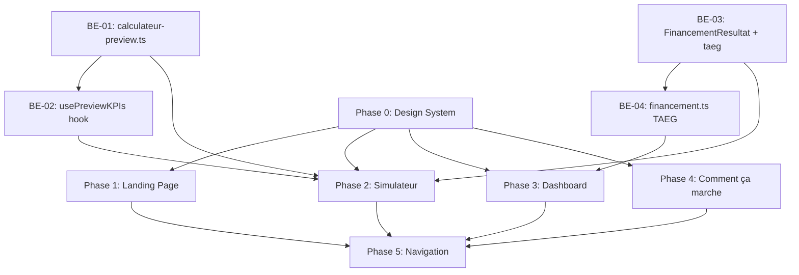

# Plan Technique — Migration UX « Verdant Simulator »

> **Auteur** : Winston (Architecte)
> **Date** : 2026-03-25
> **Version** : 1.0
> **Référence UX** : [docs/ux/stitch/v1/plan-migration-ux.md](file:///D:/Devs/Renta_Immo/docs/ux/stitch/v1/plan-migration-ux.md)

---

## 1. Synthèse Critique du Plan UX

Le plan UX de Sally est solide et bien structuré. Après analyse croisée avec le code source (stack v5.1 — Next.js 16, Tailwind v4, Zustand, 530 TU), j'identifie **4 zones de risque technique** non traitées dans le plan UX qui doivent être résolues **avant** que le PM puisse découper les stories.

| Zone                                                    | Risque                                                                                                                                                                                                                                                       | Criticité            |
| ------------------------------------------------------- | ------------------------------------------------------------------------------------------------------------------------------------------------------------------------------------------------------------------------------------------------------------ | -------------------- |
| **Calcul partiel temps réel (sidebar)**                 | Le moteur de calcul est côté serveur uniquement. La sidebar Results Anchor nécessite un moteur client-side partiel                                                                                                                                           | 🔴 Bloquant Phase 2  |
| **TAEG non exposé dans l'API**                          | [FinancementResultat](file:///d:/Devs/Renta_Immo/src/types/calculateur.ts#224-230) ne contient pas le TAEG. Il faut l'ajouter au type et au calcul                                                                                                           | 🟠 Requis Phase 2    |
| **Tailwind v4 CSS-first — pas de `tailwind.config.ts`** | La config Tailwind en v4 se fait via `@theme {}` dans [globals.css](file:///d:/Devs/Renta_Immo/src/app/globals.css). Le plan UX parle d'un `<script id="tailwind-config">` des maquettes HTML (qui utilisent le CDN Tailwind v3). Il faut adapter les tokens | 🟠 Requis Phase 0    |
| **Routing `/comment-ca-marche` vs `/en-savoir-plus`**   | La stratégie de redirection SEO (301 permanent) n'est pas documentée. Risque de régression SEO si mal exécuté                                                                                                                                                | 🟡 Important Phase 4 |

---

## 2. Analyse par Phase — Compléments Techniques

---

### PHASE 0 — Fondations Design System

> Branche : `feature/verdant-design-tokens`
> Estimation : **2 stories**

#### 2.0.1 — Adaptation Tailwind v4 (⚠️ Non mentionné dans le plan UX)

> [!IMPORTANT]
> L'application utilise **Tailwind CSS v4** (Lightning CSS, CSS-first). Il n'y a **pas** de `tailwind.config.ts`. La configuration des tokens se fait **exclusivement** dans [globals.css](file:///d:/Devs/Renta_Immo/src/app/globals.css) via `@theme {}`. Les tokens extraits des fichiers `code.html` (qui utilisent le CDN Tailwind v3 avec `<script id="tailwind-config">`) **ne peuvent pas être copiés tels quels**.

**Traduction Tailwind v4 des tokens** à faire :

```css
/* Dans src/app/globals.css — bloc @theme {} à créer/enrichir */
@theme {
  /* === Palette Verdant (Material Design 3) === */
  --color-primary: #012d1d;
  --color-primary-container: #1b4332;
  --color-secondary-fixed: #d6e6dd; /* sage wash */
  --color-surface: #f9f9f8;
  --color-surface-container-low: #f3f4f0;
  --color-on-surface: #191c1c;
  --color-outline-variant: #c1c8c2;
  --color-error: #ba1a1a;
  /* ... 25 autres tokens sémantiques */

  /* === Typographie === */
  --font-headline: 'Manrope', sans-serif;
  --font-body: 'Inter', sans-serif;

  /* === Radii === */
  --radius-xl: 1.5rem;
  --radius-full: 9999px;

  /* === Shadows === */
  --shadow-ambient: 0 20px 40px rgba(27, 67, 50, 0.06);
}
```

> [!NOTE]
> Les anciens tokens (`--color-forest`, `--color-sage`) **restent** dans le bloc `@theme` pendant la migration pour ne pas casser les composants existants. On les préfixe avec un commentaire `/* DEPRECATED */` pour guider la suppression en fin de migration.

#### 2.0.2 — Fichiers impactés Phase 0

| Fichier                                                               | Action | Détail                                                                                                                    |
| --------------------------------------------------------------------- | ------ | ------------------------------------------------------------------------------------------------------------------------- |
| [src/app/globals.css](file:///d:/Devs/Renta_Immo/src/app/globals.css) | MODIFY | Ajouter bloc `@theme {}` avec tokens Verdant. Ajouter classes utilitaires `.btn-verdant`, `.input-verdant`, `.glass-card` |
| `src/styles/verdant-tokens.ts`                                        | NEW    | Export TypeScript des couleurs pour Recharts (les charts ne lisent pas les CSS vars nativement)                           |
| [src/app/layout.tsx](file:///d:/Devs/Renta_Immo/src/app/layout.tsx)   | MODIFY | Ajouter `next/font` pour Manrope + Material Symbols Outlined                                                              |

**Implémentation `next/font`** :

```typescript
// src/app/layout.tsx
import { Inter, Manrope } from 'next/font/google';

const inter = Inter({ subsets: ['latin'], variable: '--font-body', display: 'swap' });
const manrope = Manrope({
  subsets: ['latin'],
  variable: '--font-headline',
  display: 'swap',
  weight: ['400', '500', '600', '700', '800'],
});
```

> [!CAUTION]
> **Material Symbols** ne peut pas être importé via `next/font` (pas dans le registre). Il faut l'ajouter en tant que stylesheet Google Fonts dans le `<head>` via `next/head` ou le metadata API. Poids estimé : ~30 KB supplémentaires. Utiliser le paramètre `material_symbols_outlined` avec `display=swap`.

#### 2.0.3 — Tests Phase 0

- Lancer `npm run type-check` après chaque modification de [globals.css](file:///d:/Devs/Renta_Immo/src/app/globals.css)
- Lancer `npm run test` pour valider qu'aucun test ne casse (les tokens CSS n'ont pas d'impact sur les TU)
- Vérification visuelle : `npm run dev`, inspecter les CSS custom properties dans DevTools

---

### PHASE 1 — Landing Page

> Branche : `feature/verdant-landing-page`
> Estimation : **2 stories**

#### 2.1.1 — Composants à créer

| Composant             | Fichier                                          | Contenu                                                     |
| --------------------- | ------------------------------------------------ | ----------------------------------------------------------- |
| `HeroSection`         | `src/components/landing/HeroSection.tsx`         | Split grid 12 colonnes, slogan gauche, image/overlay droite |
| `BentoFeatures`       | `src/components/landing/BentoFeatures.tsx`       | 3 cartes features                                           |
| `TestimonialsSection` | `src/components/landing/TestimonialsSection.tsx` | Section témoignages (données fictives autorisées)           |
| `LandingCTA`          | `src/components/landing/LandingCTA.tsx`          | Bouton pill CTA final                                       |
| `VerdantNavbar`       | `src/components/layout/VerdantNavbar.tsx`        | Navbar glassmorphism avec liens mis à jour                  |
| `VerdantFooter`       | `src/components/layout/VerdantFooter.tsx`        | Footer avec liens légaux                                    |

#### 2.1.2 — Refonte [src/app/page.tsx](file:///d:/Devs/Renta_Immo/src/app/page.tsx)

La page actuelle sera **entièrement remplacée** par l'assemblage des nouveaux composants. Pas de régression possible (pas de logique métier dans la landing page).

#### 2.1.3 — Mise à jour Navbar — Liens

| Lien actuel       | Nouveau lien         | Note                                  |
| ----------------- | -------------------- | ------------------------------------- |
| `/calculateur`    | `/calculateur`       | Inchangé                              |
| `/en-savoir-plus` | `/comment-ca-marche` | Redirection 301 gérée en Phase 4      |
| Absent            | `/simulations`       | Nouveau lien (utilisateurs connectés) |

> [!NOTE]
> La navbar est actuellement dans [src/components/layout/Header.tsx](file:///d:/Devs/Renta_Immo/src/components/layout/Header.tsx). I faut créer `VerdantNavbar.tsx` **en parallèle** et switcher dans `layout.tsx` une fois validée — éviter de modifier l'existant en cours de sprint.

#### 2.1.4 — Tests Phase 1

- `npm run test` — 530 TU existants (aucun test sur la landing page, zéro risque de régression)
- E2E : Playwright — vérifier que le CTA redirige vers `/calculateur` : `npm run test:e2e`
- Snapshot visuel via `mcp_chrome-devtools_take_screenshot` — comparer avec `landing_page_accueil_premium/screen.png`
- Responsive : viewport 375px, 768px, 1440px via `mcp_chrome-devtools_emulate`

---

### PHASE 2 — Simulateur : Layout Split-Screen

> Branche : `feature/verdant-simulator`
> Estimation : **5-6 stories** (la plus complexe)

#### 2.2.1 — Travaux Backend REQUIS (bloquants)

> [!IMPORTANT]
> Cette phase **ne peut pas démarrer** côté frontend avant que les points suivants soient résolus. Ils doivent être des **pré-requis** dans le backlog (stories séparées ou sous-tasks).

**A. Calcul partiel côté client (Results Anchor)**

Le plan UX identifie correctement le besoin (section 6.1) et recommande l'**option 1 : calcul client-side**. Voici l'implémentation concrète :

Créer `src/lib/calculateur-preview.ts` — module pur, sans dépendance serveur :

```typescript
// Calculs "preview" pour la sidebar Results Anchor
// Ces formules sont des approximations rapides, pas le calcul complet

export interface PreviewKPIs {
  rendementBrut: number | null; // (loyer_annuel / prix_total) * 100
  mensualiteEstimee: number | null; // PMT simple
  investissementTotal: number | null; // prix_achat + travaux + frais_notaire_estimé
  cashflowMensuelEstime: number | null; // loyer - mensualite - charges
  taegApprox: number | null; // approximation TAEG
  coutTotalCredit: number | null; // mensualite * duree_mois - montant_emprunté
}

export function computePreviewKPIs(
  bien: Partial<BienData>,
  financement: Partial<FinancementData>,
  exploitation: Partial<ExploitationData>
): PreviewKPIs;
```

> [!NOTE]
> Le TAEG exact nécessite un calcul itératif (Newton-Raphson) qui est fait côté serveur. Pour la sidebar, une **approximation** (taux nominal + frais dossier/garantie amortis sur la durée) est suffisante et doit être différenciée visuellement (ex: tilde `~4,2%`) de la valeur exacte du dashboard résultats.

**B. Exposer le TAEG dans [FinancementResultat](file:///d:/Devs/Renta_Immo/src/types/calculateur.ts#224-230)**

Le type actuel [FinancementResultat](file:///d:/Devs/Renta_Immo/src/types/calculateur.ts#224-230) (dans [src/types/calculateur.ts](file:///d:/Devs/Renta_Immo/src/types/calculateur.ts)) ne contient pas le TAEG :

```typescript
// AVANT
export interface FinancementResultat {
  montant_emprunt: number;
  mensualite: number;
  cout_total_credit: number;
  frais_notaire: number;
}

// APRÈS — à ajouter
export interface FinancementResultat {
  montant_emprunt: number;
  mensualite: number;
  cout_total_credit: number;
  frais_notaire: number;
  taeg?: number; // NOUVEAU — calculé dans financement.ts
  capacite_endettement?: number; // NOUVEAU — taux HCSF exact (déjà dans HCSFResultat mais dupliqué ici pour la sidebar)
}
```

Le moteur de calcul `src/server/calculations/financement.ts` doit être mis à jour pour calculer et retourner le TAEG. Il existe probablement déjà une formule dans le module — vérifier avant de dupliquer.

> [!WARNING]
> **Impact tests** : La modification de [FinancementResultat](file:///d:/Devs/Renta_Immo/src/types/calculateur.ts#224-230) est un **breaking change** sur les tests existants. Il faut mettre à jour les mocks dans [tests/helpers/test-config.ts](file:///d:/Devs/Renta_Immo/tests/helpers/test-config.ts), `tests/unit/calculations/`, et les tests d'intégration. **Relancer les 530 TU** après chaque modification.

**C. Store Zustand — Réactivité des KPIs**

Le store actuel (`calculateur.store.ts`) ne fait **aucun calcul**. Il faudra ajouter un **selector dérivé** qui appelle `computePreviewKPIs` à chaque changement de champ :

```typescript
// Dans calculateur.store.ts — ajout d'un computed
getPreviewKPIs: () => PreviewKPIs;
```

En Zustand, les "computed values" se font via des selectors appelés dans le composant. Il vaut mieux exposer un hook :

```typescript
// src/hooks/usePreviewKPIs.ts
export function usePreviewKPIs(): PreviewKPIs {
  const bien = useCalculateurStore((s) => s.getActiveScenario().bien);
  const financement = useCalculateurStore((s) => s.getActiveScenario().financement);
  const exploitation = useCalculateurStore((s) => s.getActiveScenario().exploitation);
  return useMemo(
    () => computePreviewKPIs(bien, financement, exploitation),
    [bien, financement, exploitation]
  );
}
```

#### 2.2.2 — Composants à créer (Frontend)

| Composant            | Fichier                                        | Priorité    |
| -------------------- | ---------------------------------------------- | ----------- |
| `SimulatorLayout`    | `src/components/layout/SimulatorLayout.tsx`    | 🔴 Critique |
| `ResultsAnchor`      | `src/components/layout/ResultsAnchor.tsx`      | 🔴 Critique |
| `ResultsAnchorStep1` | `src/components/layout/ResultsAnchorStep1.tsx` | 🟠          |
| `ResultsAnchorStep2` | `src/components/layout/ResultsAnchorStep2.tsx` | 🟠          |
| `ResultsAnchorStep3` | `src/components/layout/ResultsAnchorStep3.tsx` | 🟠          |
| `ResultsAnchorStep4` | `src/components/layout/ResultsAnchorStep4.tsx` | 🟠          |
| `ResultsAnchorStep5` | `src/components/layout/ResultsAnchorStep5.tsx` | 🟠          |
| `VerdantSlider`      | `src/components/ui/VerdantSlider.tsx`          | 🟡 (Step 2) |

**Architecture `SimulatorLayout`** :

```tsx
// Layout principal — wrapper autour du contenu /calculateur
<div className="grid grid-cols-[340px_1fr] h-screen">
  <aside className="sticky top-0 h-screen overflow-hidden">
    <ResultsAnchor currentStep={currentStep} />
  </aside>
  <main className="overflow-y-auto">{children}</main>
</div>
```

> [!CAUTION]
> **Responsive mobile** : Le split-screen s'effondre en stack vertical sur mobile. La sidebar `ResultsAnchor` devient un **panneau glassmorphism fixé en bas de l'écran** (position: fixed, bottom: 0, z-index élevé). Ce comportement doit être implémenté dès le départ pour ne pas créer de dette technique. Utiliser CSS `@media (max-width: 1024px)` avec Tailwind (`lg:grid-cols-[340px_1fr]`).

#### 2.2.3 — Composants à modifier (Formulaire)

| Composant              | Changements clés                                             | Risques                                                        |
| ---------------------- | ------------------------------------------------------------ | -------------------------------------------------------------- |
| `FormWizard.tsx`       | Intégrer dans `SimulatorLayout`, stepper horizontal          | Modifier le layout actuel sans casser la logique de navigation |
| `ProgressStepper.tsx`  | Design horizontal, cercles connectés                         | Aucun — pas de logique métier                                  |
| `StepBien.tsx`         | Cartes TypeBien avec icônes, accordéon Acquisition Costs     | Les champs doivent tous rester                                 |
| `StepFinancement.tsx`  | Slider durée (créer `VerdantSlider`), Pro Tip encadré        | Le slider doit synchroniser avec `updateFinancement()`         |
| `StepExploitation.tsx` | Style large loyer + taux occupation, encadré Vacancy Reserve | Aucun champ ne doit être supprimé                              |
| `StepAssocies.tsx`     | Toggle fixed/percentage pour charges                         | Logique toggle déjà existante — vérifier                       |
| `StepStructure.tsx`    | 3 familles de cartes expansibles (LMNP, Foncier, SCI)        | **6 régimes** à préserver dans les sous-cartes                 |

> [!IMPORTANT]
> **Step 5 — 6 régimes à préserver** :
>
> - LMNP → Micro-BIC / Réel (sous-sélection après clic sur la carte LMNP)
> - Revenus Fonciers → Micro-Foncier / Foncier Réel
> - SCI à l'IS → Capitalisation / Distribution
>
> Les maquettes ne montrent que 3 cartes. La solution : **accordéon interne** à chaque carte pour choisir le sous-régime. Ne jamais supprimer un régime fiscal.

#### 2.2.4 — Tests Phase 2

- `npm run test` — les 530 TU DOIVENT passer, notamment les tests du store et des hooks
- TU à créer : `tests/unit/lib/calculateur-preview.test.ts` — tester `computePreviewKPIs` avec des cas limites (champs vides, prix = 0)
- TU à créer : `tests/unit/hooks/usePreviewKPIs.test.ts`
- TU à mettre à jour : tous les tests qui mockent `FinancementResultat` si TAEG ajouté
- E2E : `npm run test:e2e` — `tests/e2e/calculateur/validation.spec.ts` (parcours complet formulaire)
- Test de régression calcul : `npm run test:regression` — les KPIs affichés en sidebar ne doivent PAS diverger de > 0.5% des résultats finaux

---

### PHASE 3 — Dashboard Résultats & Projections

> Branche : `feature/verdant-results`
> Estimation : **3-4 stories**

#### 2.3.1 — Nouveau routing onglets résultats

Le plan UX propose 4 onglets (Analyse, Projections, Données marché, Propriétés). Techniquement, les deux premiers sont livrables en Phase 3, les deux derniers sont des stubs.

**Structure de routes recommandée** :

```
/calculateur/resultats              → redirige vers /calculateur/resultats/analyse (par défaut)
/calculateur/resultats/analyse      → Dashboard.tsx refactorisé
/calculateur/resultats/projections  → ProjectionTable.tsx + PatrimoineChart.tsx
/calculateur/resultats/marche       → Stub "Bientôt disponible"
/calculateur/resultats/proprietes   → Stub "Bientôt disponible"
```

**Alternative plus simple** : Onglets internes dans le même composant `Dashboard.tsx` (sans routes séparées), gérés par state local. Recommandé pour la Phase 3 — évite de gérer la persistance de l'état entre routes.

> [!NOTE]
> Choisir entre routage URL vs state local **avant** le début du dev. L'avantage du routage URL : liens partageables, historique browser natif. Inconvénient : le state Zustand (résultats) doit être accessible depuis toutes les sous-routes (déjà le cas avec le persist localStorage).

#### 2.3.2 — Données à enrichir dans `CalculResultats`

| KPI manquant dans l'UI             | État dans les types                              | Action                                               |
| ---------------------------------- | ------------------------------------------------ | ---------------------------------------------------- |
| **TAEG**                           | Dans `FinancementResultat` après Phase 2         | Afficher dans onglet Analyse                         |
| **Coût total crédit**              | `FinancementResultat.cout_total_credit` ✅       | Déjà disponible                                      |
| **Effort d'épargne mensuel**       | `RentabiliteResultat.effort_epargne_mensuel?` ✅ | Déjà calculé — juste à afficher comme KPI            |
| **Patrimoine net (courbe 20 ans)** | `ProjectionAnnuelle.patrimoineNet` ✅            | Données existent dans `ProjectionData.projections[]` |
| **TRI**                            | `ProjectionData.totaux.tri` ✅                   | Déjà calculé                                         |
| **NPV/VAN**                        | ❌ Non calculé                                   | Hors scope — documenter comme V2                     |

#### 2.3.3 — Composants à modifier

| Composant               | Key changes                                        | Note                                                             |
| ----------------------- | -------------------------------------------------- | ---------------------------------------------------------------- |
| `Dashboard.tsx`         | Layout sidebar navigation + onglets                | Orchestrateur central — modifier avec précaution                 |
| `ScorePanel.tsx`        | Score grand format, badge EXCELLENT/BON/MOYEN      | Affichage pur — pas de logique métier                            |
| `MetricCard.tsx`        | Style tonal, pas de bordures                       | Composant atomique                                               |
| `CashflowChart.tsx`     | Couleurs emerald depuis `verdant-tokens.ts`        | Import des tokens TS pour Recharts                               |
| `PatrimoineChart.tsx`   | Gradient fill Primary → Transparent                | Recharts `linearGradient`                                        |
| `FiscalComparator.tsx`  | Liste verticale, badge RECOMMANDÉ                  | Pas de breaking change                                           |
| `AmortizationTable.tsx` | Accordéon, lien "Voir le tableau 20 ans"           | Vérifier les tests existants                                     |
| `ProjectionTable.tsx`   | Toggle Annuel/Trimestriel, KPIs charts juxtaposés  | Toggle = state local                                             |
| `DownloadPdfButton.tsx` | Bouton pill emerald + bouton Save Draft secondaire | Save Draft : route `/api/simulations` POST (déjà implémentée ✅) |

#### 2.3.4 — Tests Phase 3

- `npm run test` — tous les 530 TU
- Vérification **valeurs identiques** avant/après : lancer une simulation test, noter les KPIs, migrer les composants, vérifier les mêmes KPIs affichés (test de non-régression visuel avec Chrome DevTools)
- Lighthouse SEO + Accessibility : `mcp_chrome-devtools_lighthouse_audit` sur `/calculateur/resultats`

---

### PHASE 4 — Page « Comment ça marche »

> Branche : `feature/verdant-how-it-works`
> Estimation : **3 stories**

#### 2.4.1 — Stratégie de migration de route (⚠️ Non mentionné dans le plan UX)

La page actuelle est sur `/en-savoir-plus`. La nouvelle architecture utilise `/comment-ca-marche`. Il faut une stratégie de redirection **sans perte SEO**.

**Solution recommandée — Redirection permanente Next.js** :

```typescript
// next.config.ts — à ajouter
const nextConfig = {
  // ... config existante
  async redirects() {
    return [
      {
        source: '/en-savoir-plus',
        destination: '/comment-ca-marche',
        permanent: true, // HTTP 301
      },
    ];
  },
};
```

> [!CAUTION]
> **Attention mise en cache Vercel** : Les redirections 301 sont mises en cache agressivement par les CDN. Tester en preview avant le déploiement en production.

#### 2.4.2 — Architecture de routes Next.js

```
src/app/
├── comment-ca-marche/
│   ├── layout.tsx                    [NEW] — Sidebar navigation + wrapper
│   ├── page.tsx                      [NEW] — Hub principal (cards vers sous-pages)
│   ├── scoring-rendement/
│   │   └── page.tsx                  [NEW]
│   ├── financement-levier/
│   │   └── page.tsx                  [NEW]
│   ├── fiscalite-normes/
│   │   └── page.tsx                  [NEW]
│   └── projections-dpe/
│       └── page.tsx                  [NEW]
└── en-savoir-plus/
    └── page.tsx                      [KEEP — retirer le contenu, laisser redirect ou supprimer après validation SEO]
```

> [!IMPORTANT]
> **Préservation du contenu** : La page `en-savoir-plus/page.tsx` fait 2093 lignes. Le contenu doit être **découpé** et **redistribué** dans les 4 sous-pages selon la matrice du plan UX (section 4.4). Aucune section ne peut être supprimée. Créer un fichier de contenu partagé `src/content/comment-ca-marche/` avec les sections MDX ou TS si besoin de les réutiliser.

#### 2.4.3 — Layout de la section

```typescript
// src/app/comment-ca-marche/layout.tsx
// Sidebar de navigation latérale + contenu scrollable
// Sur mobile : tabs horizontaux en haut
export default function CommentCaMarcheLayout({ children }: { children: React.ReactNode }) {
  return (
    <div className="flex min-h-screen">
      <CommentCaMarcheNav />       {/* Sidebar catégories */}
      <main className="flex-1">
        {children}
      </main>
    </div>
  );
}
```

#### 2.4.4 — Vérification contenu

| Obligation                  | Méthode de vérification                                                                                     |
| --------------------------- | ----------------------------------------------------------------------------------------------------------- |
| 100% du contenu migré       | Grep des formules clés (`PMT`, `Cash-flow`, `Déficit foncier`, `HCSF`, `TRI`) dans les nouvelles sous-pages |
| Aucune section manquante    | Comparer la table des matières actuelle (13 sections) avec les sous-pages créées                            |
| Liens internes fonctionnels | `npm run test:e2e` — tester la navigation entre sous-pages                                                  |

#### 2.4.5 — Tests Phase 4

- `npm run test` — 530 TU (aucun test existant sur `/en-savoir-plus` — zéro risque de régression moteur)
- E2E : Créer `tests/e2e/comment-ca-marche/navigation.spec.ts` — tester la navigation entre les 4 sous-pages
- Vérifier `npm run build` — s'assurer que les nouvelles routes compilent sans erreur Next.js
- Test de redirection : `curl -I http://localhost:3000/en-savoir-plus` → doit retourner `301 Moved Permanently`

---

### PHASE 5 — Navigation Globale

> Branche : `feature/verdant-navigation`
> Estimation : **1 story**

#### 2.5.1 — Navbar `VerdantNavbar.tsx`

Créée en Phase 1, intégrée globalement en Phase 5. Remplace `Header.tsx` dans `src/app/layout.tsx`.

Liens de navigation finale :

| Item                | Route                | Auth requis                  |
| ------------------- | -------------------- | ---------------------------- |
| Simulateur          | `/calculateur`       | Non                          |
| Comment ça marche   | `/comment-ca-marche` | Non                          |
| Mes simulations     | `/simulations`       | Oui (masqué si non connecté) |
| Connexion           | `/auth/login`        | Non (masqué si connecté)     |
| CTA "Nouvelle calc" | `/calculateur`       | Non                          |

#### 2.5.2 — Footer `VerdantFooter.tsx`

Créé en Phase 1, intégré globalement en Phase 5. Contenu :

- Mentions légales (si page existante — à vérifier)
- Politique de confidentialité
- Copyright `© 2026 Renta Immo`

#### 2.5.3 — Tests Phase 5

- `npm run test:e2e` — tous les tests E2E existants (auth, CRUD simulations, formulaire) doivent passer avec la nouvelle navbar

---

## 3. Récapitulatif des Travaux Backend (Non-UI)

> [!IMPORTANT]
> Ces éléments DOIVENT être développés **avant** les phases frontend qui en dépendent. Ils méritent des stories distinctes.

| Story     | Description                                                                                                                                       | Priorité          | Dépend de |
| --------- | ------------------------------------------------------------------------------------------------------------------------------------------------- | ----------------- | --------- |
| **BE-01** | Créer `src/lib/calculateur-preview.ts` — moteur de calcul partiel côté client (rendement brut, PMT, cashflow estimate, TAEG approx)               | 🔴 Bloquant       | —         |
| **BE-02** | Créer `src/hooks/usePreviewKPIs.ts` — hook Zustand réactif sur les 3 premières sections du store                                                  | 🔴 Bloquant       | BE-01     |
| **BE-03** | Ajouter `taeg` et `capacite_endettement` dans `FinancementResultat` (types + moteur serveur `financement.ts`) et mettre à jour les mocks de tests | 🟠 Requis Phase 2 | —         |
| **BE-04** | Mettre à jour `src/server/calculations/financement.ts` pour calculer et retourner le TAEG exact                                                   | 🟠 Requis Phase 2 | BE-03     |

---

## 4. Nouvelles Interfaces TypeScript

> [!NOTE]
> Ces interfaces doivent être ajoutées dans `src/types/` avant tout développement qui en dépend. TypeScript strict = aucun `any` autorisé.

```typescript
// src/types/calculateur.ts — à ajouter

/** KPIs de preview pour la sidebar Results Anchor (calcul client partiel) */
export interface PreviewKPIs {
  rendementBrut: number | null;
  mensualiteEstimee: number | null;
  investissementTotal: number | null;
  cashflowMensuelEstime: number | null;
  taegApprox: number | null;
  coutTotalCreditEstime: number | null;
  isPartiel: true; // discriminant pour différencier des résultats complets
}

// src/types/calculateur.ts — à modifier
export interface FinancementResultat {
  montant_emprunt: number;
  mensualite: number;
  cout_total_credit: number;
  frais_notaire: number;
  taeg?: number; // NOUVEAU (Phase 2 / BE-03)
  capacite_endettement?: number; // NOUVEAU — copie du taux HCSF pour la sidebar
}
```

---

## 5. Nouveaux Fichiers à Créer — Vue d'Ensemble

```
src/
├── lib/
│   └── calculateur-preview.ts      [NEW — BE-01]
├── hooks/
│   └── usePreviewKPIs.ts           [NEW — BE-02]
├── styles/
│   └── verdant-tokens.ts           [NEW — Phase 0]
├── components/
│   ├── landing/
│   │   ├── HeroSection.tsx         [NEW — Phase 1]
│   │   ├── BentoFeatures.tsx       [NEW — Phase 1]
│   │   ├── TestimonialsSection.tsx [NEW — Phase 1]
│   │   └── LandingCTA.tsx          [NEW — Phase 1]
│   ├── layout/
│   │   ├── SimulatorLayout.tsx     [NEW — Phase 2]
│   │   ├── ResultsAnchor.tsx       [NEW — Phase 2]
│   │   ├── VerdantNavbar.tsx       [NEW — Phase 1/5]
│   │   └── VerdantFooter.tsx       [NEW — Phase 1/5]
│   └── ui/
│       └── VerdantSlider.tsx       [NEW — Phase 2]
└── app/
    └── comment-ca-marche/
        ├── layout.tsx              [NEW — Phase 4]
        ├── page.tsx                [NEW — Phase 4]
        ├── scoring-rendement/page.tsx [NEW — Phase 4]
        ├── financement-levier/page.tsx [NEW — Phase 4]
        ├── fiscalite-normes/page.tsx   [NEW — Phase 4]
        └── projections-dpe/page.tsx   [NEW — Phase 4]

next.config.ts                          [MODIFY — Phase 4, redirection 301]
```

---

## 6. Matrice des Dépendances entre Phases



---

## 7. Estimation Sprint Planning

| Sprint       | Phases                          | Stories clés                                                          | Points estimés |
| ------------ | ------------------------------- | --------------------------------------------------------------------- | -------------- |
| **Sprint 1** | Phase 0 + BE-01 + BE-02 + BE-03 | Design tokens, `calculateur-preview.ts`, types, TAEG dans financement | ~8 pts         |
| **Sprint 2** | Phase 1 + Phase 2 (layout)      | Landing page, SimulatorLayout, ResultsAnchor                          | ~10 pts        |
| **Sprint 3** | Phase 2 (steps) + Phase 3       | Steps refonte, Dashboard résultats                                    | ~10 pts        |
| **Sprint 4** | Phase 4 + Phase 5               | Comment ça marche, navigation globale                                 | ~8 pts         |

**Total : 4 sprints, ~36 points**

---

## 8. Points de Décision (Validés)

Ces décisions structurent le découpage en stories qui suit :

1. **Onglets résultats** : Routage URL ou state local ?
   ✅ **Décision : State local** (onglet géré via `<Tabs>` dans le même composant), pour simplifier la Phase 3.
2. **Save Draft** : Auth requis ou anonyme possible ?
   ✅ **Décision : Authentification requise**. Le bouton redirigera vers le login si l'utilisateur n'est pas connecté.
3. **Material Symbols vs Lucide React** :
   ✅ **Décision : Adapter Lucide React** (`strokeWidth={1.5}`) pour le MVP afin de limiter la surface de changement, la migration vers Material Symbols se fera ultérieurement.
4. **Nom du produit (Navbar)** :
   ✅ **Décision : "Petra Nova"** (remplace Renta Immo / Verdant Simulator).
5. **Route `/en-savoir-plus`** :
   ✅ **Décision : Conserver** le fichier (vide avec redirection) en Phase 4 après la mise en place de la 301, pour éviter toute erreur de navigation interne résiduelle côté Next.js avant la suppression finale.

---

## 9. Vérification Plan Global

### Tests à exécuter après chaque phase

| Phase | Commande                                  | Critère de succès                                    |
| ----- | ----------------------------------------- | ---------------------------------------------------- |
| 0     | `npm run type-check && npm run test`      | 0 erreurs TypeScript, 530 TU verts                   |
| 1     | `npm run test && npm run test:e2e`        | 530 TU + E2E navigation landing                      |
| 2     | `npm run test && npm run test:regression` | 530 TU + régression calcul identique à ±0%           |
| 3     | `npm run test && npm run test:e2e`        | 530 TU + E2E parcours complet simulateur → résultats |
| 4     | `npm run test && npm run build`           | 530 TU + build prod sans erreur + redirect 301       |
| 5     | `npm run test:e2e`                        | Tous les tests E2E existants (auth, CRUD, PDF)       |

### Non-régression calcul — Protocole

```bash
# Avant de commencer la migration :
# 1. Lancer une simulation avec les données de référence
# 2. Noter les valeurs : rendement brut, net, net-net, cashflow, score, HCSF
# 3. Après chaque phase, relancer la même simulation
# 4. Comparer les valeurs — toute divergence est une RÉGRESSION BLOQUANTE
npm run test:regression
```

### Checklist pré-PR (à ajouter dans la PR description de chaque branche)

- [ ] `npm run type-check` — 0 erreur
- [ ] `npm run lint` — 0 warning
- [ ] `npm run test` — 530+ TU verts
- [ ] `npm run test:regression` — régression calcul = 0
- [ ] Vérification visuelle sur les 3 viewports (375px, 768px, 1440px)
- [ ] Aucun `any` TypeScript introduit
- [ ] TU ajoutés pour tout nouveau code

---

_Document généré par Winston (Architecte) — v1.0 — 2026-03-25_
